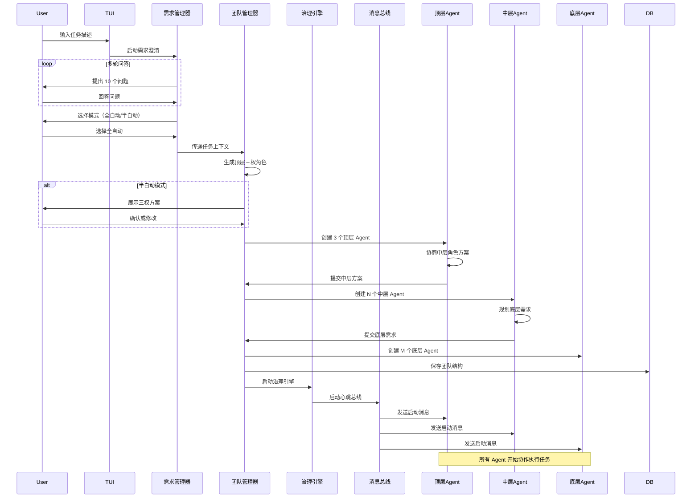
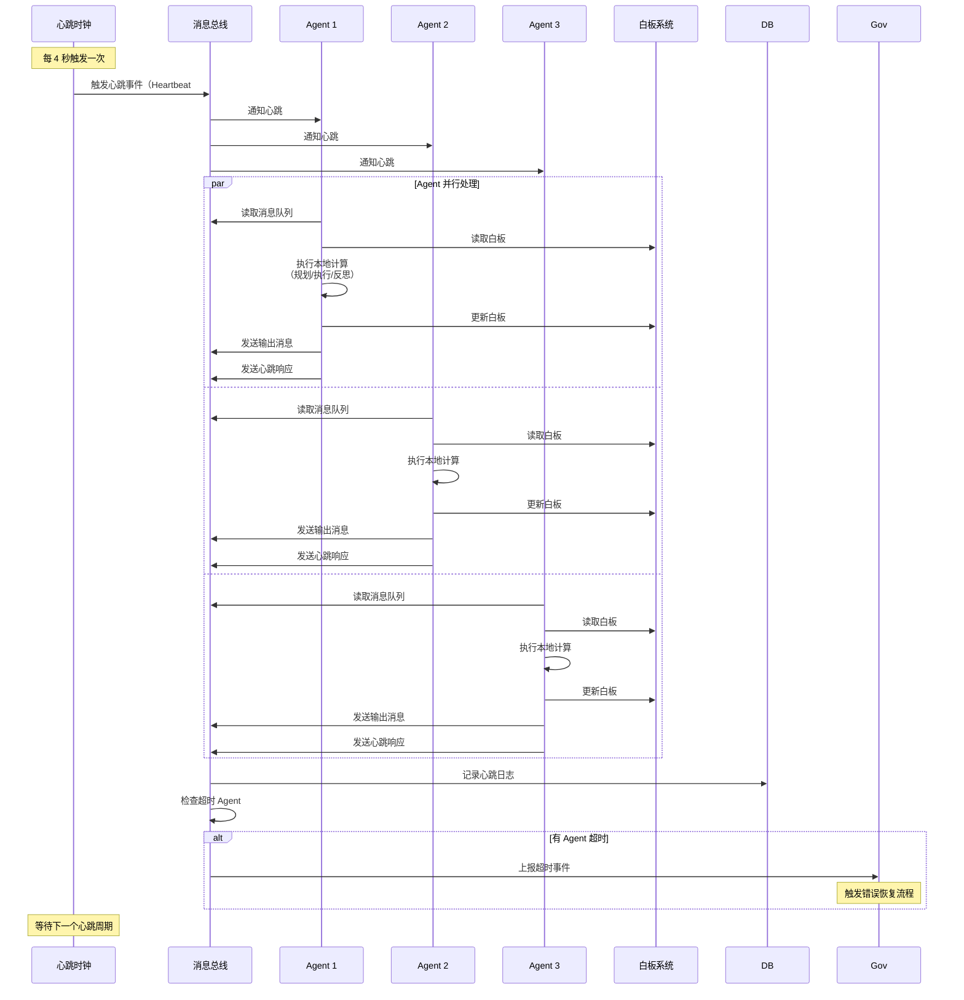
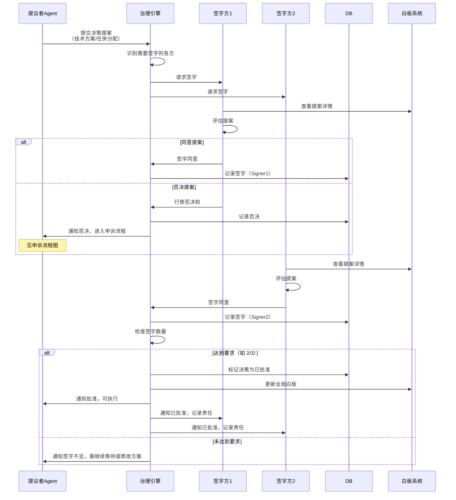
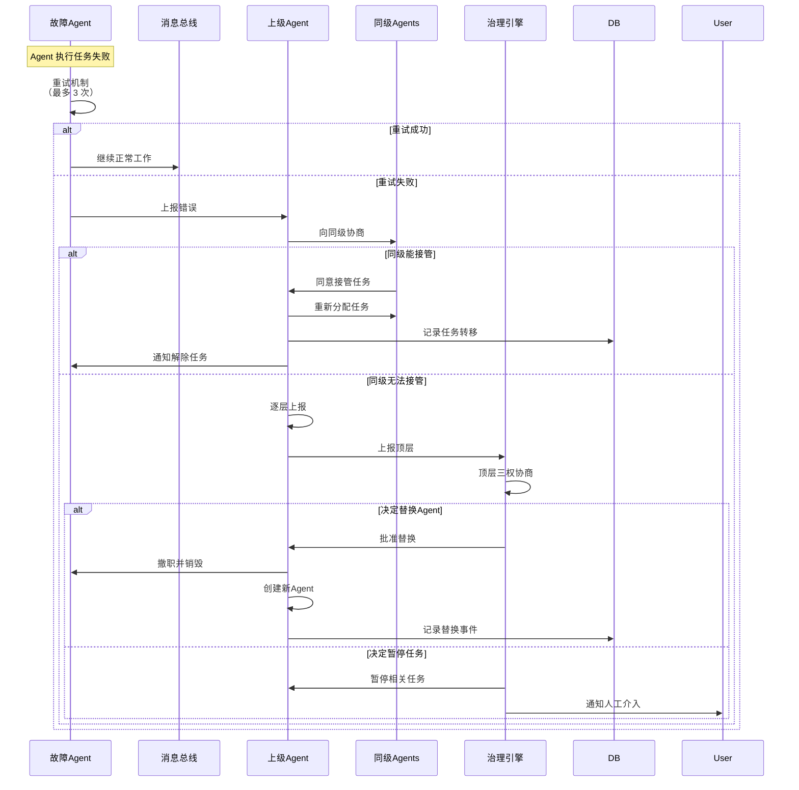

# Spec 01: 架构设计

## 1. 概述

本文档详细描述多智能体治理框架的整体架构，包括三层治理结构、核心组件、数据流设计、模块划分和接口定义。

## 2. 三层治理结构

### 2.1 层级定义

```mermaid
graph TB
    subgraph 顶层：战略决策层
        TOP1[权力 A<br/>动态角色]
        TOP2[权力 B<br/>动态角色]
        TOP3[权力 C<br/>动态角色]
    end

    subgraph 中层：战术执行层
        MID1[领导 1<br/>动态角色]
        MID2[领导 2<br/>动态角色]
        MID3[领导 3<br/>动态角色]
        MID_N[领导 N<br/>...]
    end

    subgraph 底层：操作执行层
        BOT1[Agent 1]
        BOT2[Agent 2]
        BOT3[Agent 3]
        BOT4[Agent 4]
        BOT5[Agent 5]
        BOT_N[Agent N<br/>...]
    end

    TOP1 -->|任命| MID1
    TOP2 -->|任命| MID2
    TOP3 -->|任命| MID3

    MID1 -->|分配任务| BOT1
    MID1 -->|分配任务| BOT2
    MID2 -->|分配任务| BOT3
    MID3 -->|分配任务| BOT4
    MID3 -->|分配任务| BOT5

    BOT1 -->|进度汇报| MID1
    BOT3 -->|进度汇报| MID2
    BOT5 -->|进度汇报| MID3

    MID1 -->|决策提案| TOP1
    MID2 -->|决策提案| TOP2
    MID3 -->|决策提案| TOP3
```

### 2.2 层级职责矩阵

| 层级 | 数量 | 核心职责 | 决策权限 | 通信范围 |
|------|------|---------|---------|---------|
| **顶层** | 固定 3 个 | - 任务分解与规划<br/>- 中层角色任命<br/>- 重大技术方案审批<br/>- 冲突仲裁<br/>- 质量把关 | - 可否决中层决策<br/>- 可撤职中层领导<br/>- 可调整资源分配 | - 同层三权协商<br/>- 向下任命与指导<br/>- 接收中层汇报 |
| **中层** | 动态 2-5 个 | - 领域内任务规划<br/>- 底层 Agent 管理<br/>- 进度监控与协调<br/>- 技术方案制定<br/>- 风险预警 | - 可分配底层任务<br/>- 可向顶层提案<br/>- 可评估底层绩效 | - 同层领导协商<br/>- 向上汇报与申诉<br/>- 向下分配与指导 |
| **底层** | 动态 4-5 个 | - 具体任务执行<br/>- 工具调用（代码、测试、查询）<br/>- 结果上报<br/>- 同级协作 | - 可拒绝不合理任务<br/>- 可向上级申诉 | - 同层协作<br/>- 向上汇报与请求 |

### 2.3 动态生成规则

#### 顶层三权生成
```
输入：任务描述 + 多轮问答结果
输出：三个顶层角色定义

伪代码：
function generateTopLayer(taskContext):
    prompt = """
    根据以下任务上下文，设计三个顶层角色，遵循三权分立原则：

    任务类型：{taskContext.type}
    任务描述：{taskContext.description}
    关键需求：{taskContext.requirements}

    请为每个角色定义：
    1. 角色名称（如：规划者、执行者、审查者）
    2. 核心职责（3-5 条）
    3. 决策权限（可签字/否决的事项）
    4. 制衡关系（与另外两个角色的互动规则）

    输出 JSON 格式。
    """

    response = callLLM(prompt)
    roles = parseJSON(response)

    // 验证规则
    assert roles.length == 3
    assert each role has unique name
    assert each role has checks_and_balances field

    return roles
```

#### 中层领导生成
```
输入：顶层三权协商结果 + 任务拆解计划
输出：N 个中层领导定义（N = 2-5）

伪代码：
function generateMidLayer(topLayerRoles, taskBreakdown):
    // 顶层三权分别提出方案
    proposals = []
    for role in topLayerRoles:
        proposal = role.proposeMidLayerRoles(taskBreakdown)
        proposals.append(proposal)

    // 三权协商合并方案
    prompt = """
    以下是三个顶层角色对中层领导的提案：

    提案 A（{topLayerRoles[0].name}）：{proposals[0]}
    提案 B（{topLayerRoles[1].name}）：{proposals[1]}
    提案 C（{topLayerRoles[2].name}）：{proposals[2]}

    请协商出最终方案，要求：
    1. 角色数量 2-5 个
    2. 每个角色有明确领域（如：前端、后端、测试、文档）
    3. 角色之间职责无重叠
    4. 覆盖所有任务需求

    输出 JSON 格式。
    """

    finalRoles = callLLM(prompt)

    // 顶层三权签字确认
    signatures = collectSignatures(topLayerRoles, finalRoles)
    if signatures.count < 2:
        throw "中层角色方案未获得 2/3 签字，需重新协商"

    return finalRoles
```

#### 底层 Agent 生成
```
输入：中层领导的任务分配
输出：每个中层领导下辖的 Agent 列表

伪代码：
function generateBottomLayer(midLayerRoles):
    agents = []

    for midLeader in midLayerRoles:
        // 每个中层领导决定自己需要多少底层 Agent
        agentCount = midLeader.estimateRequiredAgents()
        agentCount = clamp(agentCount, 1, 5) // 限制每个中层最多 5 个下属

        for i in range(agentCount):
            agent = {
                id: generateUUID(),
                name: "{midLeader.name}-Agent-{i+1}",
                supervisor: midLeader.id,
                role: midLeader.defineAgentRole(i),
                capabilities: ["plan", "execute", "reflect", "tool_call"]
            }
            agents.append(agent)

    totalAgents = agents.length
    if totalAgents > 50:
        throw "底层 Agent 总数超过 50，需优化中层规模"

    return agents
```

## 3. 核心组件架构

### 3.1 组件层次图

```mermaid
graph TB
    subgraph 用户交互层
        TUI[TUI界面<br/>ink组件]
        CLI[CLI命令<br/>commander]
    end

    subgraph 应用层
        SDK[SDK门面<br/>AgentTeam类]
        REQ[需求管理器<br/>多轮问答]
        LCM[生命周期管理器<br/>启动/暂停/恢复/取消]
    end

    subgraph 编排层
        TM[团队管理器<br/>角色生成/Agent创建]
        GOV[治理引擎<br/>规则执行]
        SCHED[调度器<br/>任务分配]
    end

    subgraph 治理层
        SIGN[签字模块]
        VETO[否决模块]
        APPEAL[申诉模块]
        AUDIT[问责模块]
        ELECT[选举模块]
    end

    subgraph 通信层
        BUS[消息总线<br/>心跳机制]
        ROUTER[路由器<br/>消息分发]
        QUEUE[消息队列<br/>缓冲区]
    end

    subgraph 协作层
        WB[白板管理器<br/>文件读写]
        LOCK[并发控制<br/>文件锁]
        SYNC[同步器<br/>状态一致性]
    end

    subgraph Agent层
        TOP_AGENT[顶层Agent<br/>基于pi-agent-core]
        MID_AGENT[中层Agent<br/>基于pi-agent-core]
        BOT_AGENT[底层Agent<br/>基于pi-coding-agent]
    end

    subgraph 持久化层
        DB[(SQLite数据库)]
        LOGGER[日志系统<br/>pino]
        FS[文件系统<br/>白板存储]
    end

    subgraph 底层能力层
        PICORE[@mariozechner/pi-agent-core<br/>规划/执行/反思]
        PIAI[@mariozechner/pi-ai<br/>LLM调用]
        PICODING[@mariozechner/pi-coding-agent<br/>代码生成/执行]
    end

    TUI --> SDK
    CLI --> SDK
    SDK --> REQ
    SDK --> LCM
    REQ --> TM
    LCM --> TM
    TM --> GOV
    TM --> SCHED
    GOV --> SIGN
    GOV --> VETO
    GOV --> APPEAL
    GOV --> AUDIT
    GOV --> ELECT
    SCHED --> BUS
    BUS --> ROUTER
    ROUTER --> QUEUE
    QUEUE --> TOP_AGENT
    QUEUE --> MID_AGENT
    QUEUE --> BOT_AGENT
    TOP_AGENT --> WB
    MID_AGENT --> WB
    BOT_AGENT --> WB
    WB --> LOCK
    WB --> SYNC
    SIGN --> DB
    ELECT --> DB
    AUDIT --> DB
    BUS --> LOGGER
    WB --> FS
    BOT_AGENT --> PICORE
    BOT_AGENT --> PIAI
    BOT_AGENT --> PICODING
```

### 3.2 组件职责清单

#### 用户交互层
- **TUI 界面**：基于 ink 的终端 UI，显示任务状态、Agent 面板、日志流
- **CLI 命令**：基于 commander 的命令行工具，支持 start/status/pause/resume/cancel

#### 应用层
- **SDK 门面**：提供 `AgentTeam` 类，封装所有功能，对外提供统一 API
- **需求管理器**：与用户进行多轮问答（每轮 10 问题），澄清任务需求
- **生命周期管理器**：管理任务的启动、暂停、恢复、取消

#### 编排层
- **团队管理器**：根据需求动态生成顶层/中层/底层角色，创建 Agent 实例
- **治理引擎**：加载治理规则，协调各治理模块执行
- **调度器**：将任务分配给合适的 Agent，管理任务队列

#### 治理层
- **签字模块**：处理决策签字请求，验证签字权限，记录签字历史
- **否决模块**：处理否决请求，阻塞被否决的决策，触发申诉流程
- **申诉模块**：处理申诉请求，组织投票，裁决申诉结果
- **问责模块**：追踪任务失败，定位责任人，执行惩罚（警告/降级/撤职）
- **选举模块**：每 50 个心跳周期触发选举，评估绩效，执行晋升/降级

#### 通信层
- **消息总线**：维护全局心跳时钟（4 秒周期），触发 Agent 消息处理
- **路由器**：根据消息类型和目标 Agent，将消息路由到正确的队列
- **消息队列**：为每个 Agent 维护独立的消息队列，缓冲未处理消息

#### 协作层
- **白板管理器**：管理分层白板文件，提供读写 API，处理 Markdown 解析
- **并发控制**：使用文件锁防止多个 Agent 同时写入同一白板
- **同步器**：确保白板内容在内存和磁盘之间一致

#### Agent 层
- **顶层 Agent**：基于 pi-agent-core，实现战略决策逻辑
- **中层 Agent**：基于 pi-agent-core，实现战术规划逻辑
- **底层 Agent**：基于 pi-coding-agent，实现具体执行逻辑（代码生成、工具调用）

#### 持久化层
- **SQLite 数据库**：存储任务、Agent、消息、决策、审计、选举记录
- **日志系统**：基于 pino，记录结构化日志，支持多种日志级别
- **文件系统**：存储白板 Markdown 文件

#### 底层能力层
- **pi-agent-core**：提供 Agent 基础能力（规划、执行、反思）
- **pi-ai**：提供 LLM 调用能力
- **pi-coding-agent**：提供代码生成和执行能力

## 4. 数据流设计

### 4.1 任务启动流程



### 4.2 心跳周期数据流



### 4.3 决策签字流程



### 4.4 错误恢复流程



## 5. 模块接口定义

### 5.1 核心接口伪代码

#### AgentTeam（SDK 门面）
```typescript
interface AgentTeamConfig {
    mode: 'auto' | 'semi-auto'
    heartbeatInterval: number // 默认 4000ms
    maxBottomAgents: number // 默认 5
    databasePath: string
    workspacePath: string
}

interface AgentTeam {
    // 启动团队
    function start(taskDescription: string): Promise<TaskResult>

    // 生命周期控制
    function pause(): void
    function resume(): void
    function cancel(): void

    // 状态查询
    function getStatus(): TeamStatus
    function getAgents(): Agent[]
    function getWhiteboards(): Whiteboard[]

    // 事件监听
    function on(event: string, callback: Function): void
    // 事件类型：
    // - 'heartbeat': 每次心跳触发
    // - 'agent:created': Agent 创建
    // - 'agent:failed': Agent 失败
    // - 'decision:pending': 决策等待签字
    // - 'task:completed': 任务完成
}
```

#### Agent 基类
```typescript
interface AgentConfig {
    id: string
    name: string
    layer: 'top' | 'mid' | 'bottom'
    role: string // 动态角色名
    supervisor?: string // 上级 Agent ID
    capabilities: string[] // ['plan', 'execute', 'reflect', 'tool_call']
}

interface Agent {
    // 核心生命周期
    function initialize(): Promise<void>
    function onHeartbeat(messages: Message[]): Promise<void>
    function shutdown(): Promise<void>

    // 消息处理
    function sendMessage(to: string, type: string, content: any): void
    function receiveMessage(message: Message): void

    // 白板操作
    function readWhiteboard(layer: string): Promise<string>
    function writeWhiteboard(content: string): Promise<void>

    // 决策操作
    function proposeDecision(content: any, requireSigners: string[]): Promise<Decision>
    function signDecision(decisionId: string): Promise<void>
    function vetoDecision(decisionId: string, reason: string): Promise<void>

    // 状态查询
    function getStatus(): AgentStatus
    function getMetrics(): AgentMetrics // 绩效指标
}
```

#### 消息总线
```typescript
interface MessageBusConfig {
    heartbeatInterval: number
    maxQueueSize: number
}

interface MessageBus {
    // 启动与停止
    function start(): void
    function stop(): void

    // 消息操作
    function sendMessage(message: Message): void
    function broadcastMessage(message: Message): void
    function getMessages(agentId: string): Message[]

    // 心跳管理
    function onHeartbeat(callback: Function): void
    function getCurrentHeartbeat(): number

    // Agent 注册
    function registerAgent(agentId: string): void
    function unregisterAgent(agentId: string): void
    function checkAgentHealth(agentId: string): boolean
}
```

#### 白板系统
```typescript
interface WhiteboardConfig {
    workspacePath: string
    enableVersioning: boolean
}

interface WhiteboardSystem {
    // 读写操作
    function read(layer: string, agentId?: string): Promise<string>
    function write(layer: string, content: string, agentId: string): Promise<void>
    function append(layer: string, content: string, agentId: string): Promise<void>

    // 权限控制
    function canRead(agentId: string, whiteboardPath: string): boolean
    function canWrite(agentId: string, whiteboardPath: string): boolean

    // 并发控制
    function acquireLock(whiteboardPath: string): Promise<Lock>
    function releaseLock(lock: Lock): void

    // 同步操作
    function syncToMemory(whiteboardPath: string): Promise<void>
    function syncToDisk(): Promise<void>
}
```

#### 治理引擎
```typescript
interface GovernanceConfig {
    electionInterval: number // 选举周期（心跳数）
    signatureThreshold: number // 签字阈值（如 2/3）
    warningThreshold: number // 警告次数阈值（如 3 次撤职）
}

interface GovernanceEngine {
    // 启动与停止
    function initialize(): void
    function shutdown(): void

    // 决策管理
    function submitDecision(decision: Decision): Promise<DecisionResult>
    function signDecision(decisionId: string, signerId: string): Promise<void>
    function vetoDecision(decisionId: string, vetoerId: string, reason: string): Promise<void>
    function appealDecision(decisionId: string, appealerId: string, arguments: string): Promise<AppealResult>

    // 问责管理
    function reportFailure(taskId: string, responsibleAgentId: string, reason: string): Promise<void>
    function issueWarning(agentId: string): Promise<void>
    function demoteAgent(agentId: string): Promise<void>
    function dismissAgent(agentId: string): Promise<void>

    // 选举管理
    function triggerElection(layer: string): Promise<ElectionResult>
    function evaluatePerformance(agentId: string): PerformanceScore
    function promoteAgent(agentId: string): Promise<void>
}
```

## 6. 部署架构

### 6.1 进程模型

```
┌─────────────────────────────────────────────────────────┐
│                     主进程（Node.js）                    │
│  ┌───────────────────────────────────────────────────┐  │
│  │                   TUI 界面 (ink)                  │  │
│  └───────────────────────────────────────────────────┘  │
│  ┌───────────────────────────────────────────────────┐  │
│  │                  SDK 核心引擎                     │  │
│  │  ┌─────────────┐  ┌─────────────┐               │  │
│  │  │ 团队管理器  │  │ 治理引擎    │               │  │
│  │  └─────────────┘  └─────────────┘               │  │
│  │  ┌─────────────┐  ┌─────────────┐               │  │
│  │  │ 消息总线    │  │ 白板系统    │               │  │
│  │  └─────────────┘  └─────────────┘               │  │
│  └───────────────────────────────────────────────────┘  │
│  ┌───────────────────────────────────────────────────┐  │
│  │                Agent 运行时池                     │  │
│  │  ┌──────┐  ┌──────┐  ┌──────┐  ┌──────┐         │  │
│  │  │Top#1 │  │Top#2 │  │Top#3 │  │Mid#1 │  ...    │  │
│  │  └──────┘  └──────┘  └──────┘  └──────┘         │  │
│  │  ┌──────┐  ┌──────┐  ┌──────┐                   │  │
│  │  │Bot#1 │  │Bot#2 │  │Bot#3 │  ...               │  │
│  │  └──────┘  └──────┘  └──────┘                   │  │
│  └───────────────────────────────────────────────────┘  │
│  ┌───────────────────────────────────────────────────┐  │
│  │              持久化层（SQLite + 文件系统）        │  │
│  └───────────────────────────────────────────────────┘  │
└─────────────────────────────────────────────────────────┘
```

**说明**：
- 所有组件运行在单一 Node.js 进程中
- Agent 不是独立进程，而是对象实例（轻量级）
- 如需隔离，可选用 Worker Threads（未来版本）

### 6.2 文件系统布局

```
用户项目根目录/
├── .agent-workspace/              # 运行时工作区（.gitignore）
│   ├── whiteboards/
│   │   ├── top-layer.md
│   │   ├── mid-layer-architect.md
│   │   ├── mid-layer-pm.md
│   │   ├── bottom-layer-agent-1.md
│   │   ├── bottom-layer-agent-2.md
│   │   └── ...
│   ├── global-whiteboard.md
│   ├── task.db                    # SQLite 数据库
│   ├── logs/
│   │   ├── message-bus.log
│   │   ├── audit.log
│   │   ├── performance.log
│   │   └── error.log
│   └── temp/                      # 临时文件（代码生成、测试输出等）
└── 用户项目文件...
```

## 7. 扩展性设计

### 7.1 插件系统（V2.0 预留）

```typescript
interface Plugin {
    name: string
    version: string

    // 生命周期钩子
    function onTeamInitialize(team: AgentTeam): void
    function onAgentCreate(agent: Agent): void
    function onHeartbeat(heartbeatNumber: number): void
    function onTaskComplete(result: TaskResult): void

    // 自定义组件
    customAgentTypes?: Record<string, AgentClass>
    customMessageTypes?: Record<string, MessageClass>
    customGovernanceRules?: GovernanceRule[]
}

// 使用示例（伪代码）
const team = new AgentTeam(config)
team.use(new CustomAuthPlugin())
team.use(new PerformanceMonitorPlugin())
```

### 7.2 远程协作（V2.0 预留）

```
┌──────────────┐         ┌──────────────┐
│   机器 A     │         │   机器 B     │
│  ┌────────┐  │         │  ┌────────┐  │
│  │ Top#1  │◄─┼────────►│  │ Top#2  │  │
│  │ Mid#1  │  │  gRPC   │  │ Mid#2  │  │
│  │ Bot#1  │  │         │  │ Bot#2  │  │
│  └────────┘  │         │  └────────┘  │
│  SQLite DB   │         │  SQLite DB   │
└──────────────┘         └──────────────┘
         │                       │
         └───────┬───────────────┘
                 ↓
        ┌────────────────┐
        │  共享白板服务   │
        │   (S3/NAS)     │
        └────────────────┘
```

**说明**：
- V1.0 仅支持本地单机
- V2.0 可扩展为分布式部署
- 需要引入分布式锁、消息队列（如 Redis）

## 8. 性能指标

| 指标 | 目标值 | 测量方法 |
|------|--------|---------|
| **心跳处理延迟** | < 500ms | 从触发到所有 Agent 响应的时间 |
| **消息总线吞吐** | > 1000 msg/s | 每秒可处理的消息数量 |
| **白板读取延迟** | < 50ms | 从请求到返回内容的时间 |
| **白板写入延迟** | < 100ms | 包含文件锁和磁盘同步 |
| **数据库查询延迟** | < 20ms | 常见查询（按任务 ID 查询 Agent） |
| **内存占用** | < 2GB | 50 个 Agent 同时运行 |
| **TUI 刷新率** | ≥ 10 fps | 界面流畅度 |

## 9. 安全考虑（V2.0）

V1.0 暂不考虑安全性，但为未来版本预留以下设计点：

- **沙箱隔离**：Agent 执行代码时使用 VM 或 Docker 容器
- **权限管理**：细粒度的 RBAC（基于角色的访问控制）
- **审计日志**：所有敏感操作（文件修改、网络请求）记录
- **加密存储**：SQLite 数据库加密、白板文件加密
- **API 认证**：SDK 调用需要 API Key 或 Token

## 10. 总结

本架构设计确保了：
- **清晰的层级结构**：三层治理，职责明确
- **灵活的动态生成**：角色根据任务自适应
- **完整的权力制衡**：五大治理机制形成闭环
- **简单的通信模型**：心跳总线，易于理解和调试
- **可扩展的组件设计**：为未来功能预留接口

下一步将在后续 Spec 文档中详细展开各组件的实现细节。
