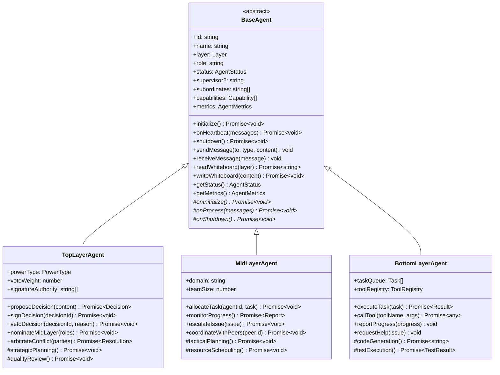
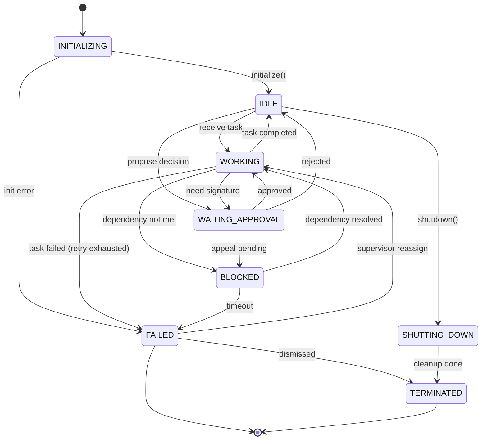

# Spec 02: Agent 模型设计

## 1. 概述

本文档详细描述 Agent 的核心模型，包括基类设计、状态机、生命周期、能力接口、层级差异化以及与 pi-mono 包的集成方式。

## 2. Agent 基类设计

### 2.1 类层次结构



### 2.2 核心数据结构

#### Agent 配置
```typescript
interface AgentConfig {
    id: string                    // 唯一标识符（UUID）
    name: string                  // 显示名称（如 "规划者"、"前端负责人"、"Agent-1"）
    layer: 'top' | 'mid' | 'bottom'
    role: string                  // 动态角色描述（如 "负责技术规划和架构设计"）
    supervisor?: string           // 上级 Agent ID（顶层为 null）
    subordinates: string[]        // 下级 Agent ID 列表
    capabilities: Capability[]    // 能力列表
    config: {
        llmModel?: string         // 使用的 LLM 模型（如 "claude-3-5-sonnet"）
        temperature?: number      // LLM 温度参数
        maxRetries: number        // 任务失败最大重试次数（默认 3）
        timeoutMs: number         // 单次任务超时时间（默认 30000ms）
    }
}

type Capability =
    | 'plan'          // 规划能力（分解任务、制定计划）
    | 'execute'       // 执行能力（调用工具、生成代码）
    | 'reflect'       // 反思能力（评估结果、改进策略）
    | 'tool_call'     // 工具调用（文件操作、命令执行、API 调用）
    | 'code_gen'      // 代码生成
    | 'test_exec'     // 测试执行
    | 'review'        // 代码审查
    | 'coordinate'    // 协调能力（与同级沟通、调解冲突）
    | 'delegate'      // 委派能力（分配任务给下级）
    | 'arbitrate'     // 仲裁能力（解决冲突、做最终决策）
```

#### Agent 状态
```typescript
enum AgentStatus {
    INITIALIZING = 'initializing',   // 正在初始化
    IDLE = 'idle',                   // 空闲，等待任务
    WORKING = 'working',             // 工作中
    WAITING_APPROVAL = 'waiting_approval', // 等待签字/审批
    BLOCKED = 'blocked',             // 被阻塞（依赖未满足、资源不足）
    FAILED = 'failed',               // 故障（连续失败、超时）
    SHUTTING_DOWN = 'shutting_down', // 正在关闭
    TERMINATED = 'terminated'        // 已终止
}

interface AgentMetrics {
    tasksCompleted: number           // 完成的任务数
    tasksFailed: number              // 失败的任务数
    averageTaskDuration: number      // 平均任务耗时（ms）
    messagesProcessed: number        // 处理的消息数
    heartbeatsResponded: number      // 响应的心跳数
    heartbeatsMissed: number         // 错过的心跳数
    warningsReceived: number         // 收到的警告数
    lastActiveTimestamp: number      // 最后活跃时间
    performanceScore: number         // 综合绩效分数（0-100）
}
```

### 2.3 基类伪代码

```typescript
abstract class BaseAgent {
    protected config: AgentConfig
    protected status: AgentStatus
    protected metrics: AgentMetrics
    protected messageBus: MessageBus
    protected whiteboardSystem: WhiteboardSystem
    protected governanceEngine: GovernanceEngine
    protected database: Database
    protected piAgentCore: PiAgentCore // pi-agent-core 实例
    protected messageQueue: Message[] = []

    constructor(config: AgentConfig, dependencies: AgentDependencies) {
        this.config = config
        this.status = AgentStatus.INITIALIZING
        this.metrics = initializeMetrics()
        this.messageBus = dependencies.messageBus
        this.whiteboardSystem = dependencies.whiteboardSystem
        this.governanceEngine = dependencies.governanceEngine
        this.database = dependencies.database

        // 集成 pi-agent-core
        this.piAgentCore = new PiAgentCore({
            model: config.config.llmModel || 'claude-3-5-sonnet',
            temperature: config.config.temperature || 0.7,
            systemPrompt: this.generateSystemPrompt()
        })
    }

    // === 公共生命周期方法 ===

    async initialize(): Promise<void> {
        logger.info(`[${this.config.name}] Initializing...`)

        // 注册到消息总线
        this.messageBus.registerAgent(this.config.id)

        // 创建白板
        await this.whiteboardSystem.createWhiteboard(this.config.layer, this.config.id)

        // 子类自定义初始化
        await this.onInitialize()

        this.status = AgentStatus.IDLE
        this.metrics.lastActiveTimestamp = Date.now()

        logger.info(`[${this.config.name}] Initialized successfully`)
    }

    async onHeartbeat(heartbeatNumber: number): Promise<void> {
        try {
            // 1. 读取消息队列
            const messages = this.messageBus.getMessages(this.config.id)
            this.messageQueue.push(...messages)

            // 2. 更新状态
            this.status = messages.length > 0 ? AgentStatus.WORKING : AgentStatus.IDLE

            // 3. 读取白板
            const whiteboardContent = await this.readWhiteboard(this.config.layer)

            // 4. 子类处理逻辑
            await this.onProcess(this.messageQueue, whiteboardContent)

            // 5. 清空已处理的消息
            this.messageQueue = []

            // 6. 更新指标
            this.metrics.heartbeatsResponded++
            this.metrics.lastActiveTimestamp = Date.now()

            // 7. 发送心跳响应
            this.sendMessage('system', 'heartbeat_ack', { heartbeatNumber })

        } catch (error) {
            logger.error(`[${this.config.name}] Heartbeat error:`, error)
            this.metrics.heartbeatsMissed++
            await this.handleError(error)
        }
    }

    async shutdown(): Promise<void> {
        logger.info(`[${this.config.name}] Shutting down...`)
        this.status = AgentStatus.SHUTTING_DOWN

        // 子类自定义清理
        await this.onShutdown()

        // 注销消息总线
        this.messageBus.unregisterAgent(this.config.id)

        this.status = AgentStatus.TERMINATED
        logger.info(`[${this.config.name}] Shutdown complete`)
    }

    // === 消息处理 ===

    sendMessage(to: string, type: string, content: any): void {
        const message: Message = {
            id: generateUUID(),
            from: this.config.id,
            to: to,
            type: type,
            content: content,
            timestamp: Date.now()
        }

        this.messageBus.sendMessage(message)
        this.metrics.messagesProcessed++
    }

    broadcastMessage(type: string, content: any): void {
        this.sendMessage('broadcast', type, content)
    }

    // === 白板操作 ===

    async readWhiteboard(layer: string, agentId?: string): Promise<string> {
        const canRead = this.whiteboardSystem.canRead(this.config.id, layer, agentId)
        if (!canRead) {
            throw new Error(`Agent ${this.config.id} has no permission to read ${layer} whiteboard`)
        }

        return await this.whiteboardSystem.read(layer, agentId)
    }

    async writeWhiteboard(content: string): Promise<void> {
        const whiteboardPath = `${this.config.layer}/${this.config.id}`
        const canWrite = this.whiteboardSystem.canWrite(this.config.id, whiteboardPath)
        if (!canWrite) {
            throw new Error(`Agent ${this.config.id} has no permission to write to ${whiteboardPath}`)
        }

        await this.whiteboardSystem.write(this.config.layer, content, this.config.id)
    }

    async appendToGlobalWhiteboard(content: string): Promise<void> {
        await this.whiteboardSystem.append('global', content, this.config.id)
    }

    // === 决策操作 ===

    async proposeDecision(content: any, requireSigners: string[]): Promise<Decision> {
        return await this.governanceEngine.submitDecision({
            id: generateUUID(),
            proposerId: this.config.id,
            content: content,
            requireSigners: requireSigners,
            status: 'pending',
            createdAt: Date.now()
        })
    }

    async signDecision(decisionId: string): Promise<void> {
        await this.governanceEngine.signDecision(decisionId, this.config.id)
    }

    async vetoDecision(decisionId: string, reason: string): Promise<void> {
        await this.governanceEngine.vetoDecision(decisionId, this.config.id, reason)
    }

    // === 状态查询 ===

    getStatus(): AgentStatus {
        return this.status
    }

    getMetrics(): AgentMetrics {
        return { ...this.metrics }
    }

    // === 错误处理 ===

    protected async handleError(error: Error): Promise<void> {
        logger.error(`[${this.config.name}] Error:`, error)

        // 重试机制
        const retryCount = this.getRetryCount()
        if (retryCount < this.config.config.maxRetries) {
            logger.info(`[${this.config.name}] Retrying (${retryCount + 1}/${this.config.config.maxRetries})...`)
            this.incrementRetryCount()
            return
        }

        // 超过重试次数，上报上级
        this.status = AgentStatus.FAILED
        this.metrics.tasksFailed++

        if (this.config.supervisor) {
            this.sendMessage(this.config.supervisor, 'error_report', {
                error: error.message,
                stack: error.stack,
                metrics: this.metrics
            })
        }
    }

    // === 抽象方法（子类必须实现）===

    protected abstract onInitialize(): Promise<void>
    protected abstract onProcess(messages: Message[], whiteboardContent: string): Promise<void>
    protected abstract onShutdown(): Promise<void>

    // === 辅助方法 ===

    protected generateSystemPrompt(): string {
        return `
你是一个多智能体团队中的 Agent，名称：${this.config.name}，角色：${this.config.role}。
你的层级：${this.config.layer}，能力：${this.config.capabilities.join(', ')}。

你的职责：
${this.getResponsibilitiesDescription()}

协作规则：
1. 通过消息总线与其他 Agent 通信
2. 通过白板共享信息和计划
3. 重大决策需要签字和协商
4. 遇到问题及时上报上级
5. 每个心跳周期（4 秒）处理一次消息

当前任务上下文将在每次心跳时提供。
        `.trim()
    }

    protected abstract getResponsibilitiesDescription(): string

    private retryCount: number = 0
    private getRetryCount(): number { return this.retryCount }
    private incrementRetryCount(): void { this.retryCount++ }
}
```

## 3. 顶层 Agent（三权）

### 3.1 特有属性

```typescript
interface TopLayerAgentConfig extends AgentConfig {
    powerType: 'power_a' | 'power_b' | 'power_c' // 具体名称由 AI 动态决定
    voteWeight: number                           // 投票权重（默认 1）
    signatureAuthority: string[]                 // 有权签字的事项类型
}

class TopLayerAgent extends BaseAgent {
    protected powerType: string
    protected voteWeight: number
    protected signatureAuthority: string[]
    protected midLayerProposal: MidLayerRole[] | null = null

    protected async onInitialize(): Promise<void> {
        // 顶层特定初始化
        logger.info(`[${this.config.name}] Power type: ${this.powerType}`)

        // 如果是第一次初始化，等待团队管理器分配职责
        await this.waitForRoleAssignment()
    }

    protected async onProcess(messages: Message[], whiteboardContent: string): Promise<void> {
        // 1. 处理需要签字的决策
        const signatureRequests = messages.filter(m => m.type === 'signature_request')
        for (const request of signatureRequests) {
            await this.reviewAndSign(request)
        }

        // 2. 处理中层汇报
        const midLayerReports = messages.filter(m => m.type === 'progress_report' && m.from.startsWith('mid-'))
        if (midLayerReports.length > 0) {
            await this.reviewMidLayerProgress(midLayerReports)
        }

        // 3. 处理冲突仲裁请求
        const conflictReports = messages.filter(m => m.type === 'conflict_report')
        for (const conflict of conflictReports) {
            await this.arbitrateConflict(conflict)
        }

        // 4. 主动监督：检查全局白板，评估整体进度
        const globalWhiteboard = await this.readWhiteboard('global')
        await this.evaluateOverallProgress(globalWhiteboard)

        // 5. 如果检测到问题，与另外两个三权协商
        if (this.detectIssue()) {
            await this.initiatePeerConsultation()
        }
    }

    protected async onShutdown(): Promise<void> {
        // 记录最终绩效报告
        await this.writeWhiteboard(`
## 最终报告 - ${this.config.name}

- 签字决策数：${this.metrics.decisionsSigned}
- 否决决策数：${this.metrics.decisionsVetoed}
- 仲裁冲突数：${this.metrics.conflictsArbitrated}
        `)
    }

    // === 顶层特有方法 ===

    protected async reviewAndSign(request: Message): Promise<void> {
        const decision = request.content.decision

        // 使用 pi-agent-core 进行推理
        const analysis = await this.piAgentCore.execute({
            task: `评估以下决策是否应该签字批准：\n\n${JSON.stringify(decision, null, 2)}`,
            context: {
                myRole: this.config.role,
                whiteboardContent: await this.readWhiteboard('global')
            }
        })

        if (analysis.shouldSign) {
            await this.signDecision(decision.id)
            logger.info(`[${this.config.name}] Signed decision ${decision.id}`)
        } else {
            await this.vetoDecision(decision.id, analysis.reason)
            logger.info(`[${this.config.name}] Vetoed decision ${decision.id}: ${analysis.reason}`)
        }
    }

    protected async arbitrateConflict(conflict: Message): Promise<void> {
        const parties = conflict.content.parties
        const issue = conflict.content.issue

        // 与另外两个三权协商
        const otherTopAgents = this.getOtherTopLayerAgents()
        const votes = await Promise.all(
            otherTopAgents.map(agent =>
                this.sendMessage(agent.id, 'vote_request', { conflict })
            )
        )

        // 多数决
        const resolution = this.calculateResolution(votes)

        // 发布仲裁结果
        await this.appendToGlobalWhiteboard(`
## 仲裁结果

冲突：${issue}
涉及方：${parties.join(', ')}
决议：${resolution}
表决：${votes}
仲裁者：${this.config.name}
时间：${new Date().toISOString()}
        `)

        // 通知各方
        for (const party of parties) {
            this.sendMessage(party, 'arbitration_result', { resolution })
        }
    }

    protected getResponsibilitiesDescription(): string {
        return `
- 审批重大技术方案和任务分配
- 监督中层领导的工作进展
- 仲裁层级间的冲突
- 评估整体任务进度和质量
- 与另外两个顶层三权协商重大决策
        `.trim()
    }
}
```

## 4. 中层 Agent（领域领导）

### 4.1 特有属性

```typescript
interface MidLayerAgentConfig extends AgentConfig {
    domain: string              // 领域（如 "frontend", "backend", "testing"）
    maxSubordinates: number     // 最多管理的底层 Agent 数量
}

class MidLayerAgent extends BaseAgent {
    protected domain: string
    protected taskQueue: Task[] = []
    protected subordinateStatus: Map<string, AgentStatus> = new Map()

    protected async onInitialize(): Promise<void> {
        logger.info(`[${this.config.name}] Domain: ${this.domain}`)

        // 等待顶层分配下属
        await this.waitForSubordinateAssignment()

        // 初始化任务队列
        this.taskQueue = []
    }

    protected async onProcess(messages: Message[], whiteboardContent: string): Promise<void> {
        // 1. 接收顶层任务分配
        const taskAssignments = messages.filter(m => m.type === 'task_assign' && m.from.startsWith('top-'))
        for (const assignment of taskAssignments) {
            this.taskQueue.push(assignment.content.task)
        }

        // 2. 将任务分解并分配给底层 Agent
        if (this.taskQueue.length > 0) {
            await this.delegateTasksToSubordinates()
        }

        // 3. 收集底层进度汇报
        const subordinateReports = messages.filter(m =>
            m.type === 'progress_report' && this.config.subordinates.includes(m.from)
        )
        await this.aggregateSubordinateProgress(subordinateReports)

        // 4. 与同级中层协调
        const peerMessages = messages.filter(m => m.type === 'peer_coordination')
        for (const peerMsg of peerMessages) {
            await this.coordinateWithPeer(peerMsg)
        }

        // 5. 检测问题并决定是否上报
        const issues = await this.detectIssues()
        if (issues.length > 0) {
            await this.escalateToTopLayer(issues)
        }

        // 6. 定期向顶层汇报
        if (this.shouldReport()) {
            await this.reportToTopLayer()
        }
    }

    protected async onShutdown(): Promise<void> {
        // 确保所有任务已完成或移交
        if (this.taskQueue.length > 0) {
            logger.warn(`[${this.config.name}] Shutting down with ${this.taskQueue.length} pending tasks`)
        }
    }

    // === 中层特有方法 ===

    protected async delegateTasksToSubordinates(): Promise<void> {
        // 使用 pi-agent-core 进行任务分解
        const decomposition = await this.piAgentCore.execute({
            task: `将以下任务分解为子任务，分配给 ${this.config.subordinates.length} 个底层 Agent：\n\n${JSON.stringify(this.taskQueue, null, 2)}`,
            context: {
                subordinates: this.config.subordinates,
                subordinateCapabilities: this.getSubordinateCapabilities()
            }
        })

        // 分配任务
        for (const subtask of decomposition.subtasks) {
            const assigneeId = subtask.assignee
            this.sendMessage(assigneeId, 'task_assign', { task: subtask })
            logger.info(`[${this.config.name}] Assigned task to ${assigneeId}: ${subtask.description}`)
        }

        // 更新白板
        await this.writeWhiteboard(`
## 任务分配计划

${decomposition.subtasks.map(st => `- [${st.assignee}] ${st.description}`).join('\n')}
        `)

        this.taskQueue = []
    }

    protected async aggregateSubordinateProgress(reports: Message[]): Promise<void> {
        for (const report of reports) {
            const agentId = report.from
            const progress = report.content.progress

            this.subordinateStatus.set(agentId, progress.status)

            // 记录到白板
            await this.appendToWhiteboard(`
- [${agentId}] ${progress.status}: ${progress.description} (${progress.percentage}%)
            `)
        }
    }

    protected async coordinateWithPeer(peerMsg: Message): Promise<void> {
        // 同级协商（如前端和后端需要对齐 API 接口）
        const peerId = peerMsg.from
        const request = peerMsg.content

        const response = await this.piAgentCore.execute({
            task: `回应同级 Agent 的协调请求：${JSON.stringify(request)}`,
            context: {
                myDomain: this.domain,
                peerDomain: request.domain
            }
        })

        this.sendMessage(peerId, 'peer_coordination_response', response)
    }

    protected async escalateToTopLayer(issues: Issue[]): Promise<void> {
        // 上报问题到顶层
        for (const issue of issues) {
            this.sendMessage(this.config.supervisor!, 'issue_escalation', {
                issue: issue,
                impact: this.assessImpact(issue),
                proposedSolution: await this.proposeSolution(issue)
            })
        }
    }

    protected getResponsibilitiesDescription(): string {
        return `
- 接收顶层分配的任务，分解为子任务
- 将子任务分配给底层 Agent
- 监控底层 Agent 的进度和质量
- 与同级中层协调跨领域问题
- 检测问题并及时上报顶层
- 定期向顶层汇报整体进度
        `.trim()
    }
}
```

## 5. 底层 Agent（执行单元）

### 5.1 特有属性

```typescript
interface BottomLayerAgentConfig extends AgentConfig {
    tools: string[]  // 可用工具列表（如 ['file_read', 'file_write', 'bash', 'http_request']）
}

class BottomLayerAgent extends BaseAgent {
    protected currentTask: Task | null = null
    protected toolRegistry: ToolRegistry
    protected piCodingAgent: PiCodingAgent // pi-coding-agent 实例

    constructor(config: BottomLayerAgentConfig, dependencies: AgentDependencies) {
        super(config, dependencies)

        // 集成 pi-coding-agent
        this.piCodingAgent = new PiCodingAgent({
            model: config.config.llmModel || 'claude-3-5-sonnet',
            tools: config.tools
        })

        this.toolRegistry = dependencies.toolRegistry
    }

    protected async onInitialize(): Promise<void> {
        logger.info(`[${this.config.name}] Tools: ${this.config.tools.join(', ')}`)
    }

    protected async onProcess(messages: Message[], whiteboardContent: string): Promise<void> {
        // 1. 接收中层分配的任务
        const taskAssignments = messages.filter(m => m.type === 'task_assign' && m.from === this.config.supervisor)
        if (taskAssignments.length > 0) {
            this.currentTask = taskAssignments[0].content.task
        }

        // 2. 执行当前任务
        if (this.currentTask && this.status === AgentStatus.IDLE) {
            await this.executeCurrentTask()
        }

        // 3. 与同级协作
        const peerRequests = messages.filter(m => m.type === 'peer_help_request')
        for (const request of peerRequests) {
            await this.helpPeer(request)
        }

        // 4. 响应上级询问
        const supervisorQueries = messages.filter(m => m.type === 'status_query' && m.from === this.config.supervisor)
        if (supervisorQueries.length > 0) {
            await this.reportStatus()
        }
    }

    protected async onShutdown(): Promise<void> {
        if (this.currentTask) {
            logger.warn(`[${this.config.name}] Shutting down with incomplete task: ${this.currentTask.description}`)
        }
    }

    // === 底层特有方法 ===

    protected async executeCurrentTask(): Promise<void> {
        if (!this.currentTask) return

        this.status = AgentStatus.WORKING
        logger.info(`[${this.config.name}] Executing task: ${this.currentTask.description}`)

        try {
            // 使用 pi-coding-agent 执行任务
            const result = await this.piCodingAgent.execute({
                task: this.currentTask.description,
                context: {
                    whiteboardContent: await this.readWhiteboard(this.config.layer),
                    globalContext: await this.readWhiteboard('global')
                },
                tools: this.config.tools
            })

            // 更新白板
            await this.writeWhiteboard(`
## 任务执行结果

任务：${this.currentTask.description}
状态：${result.success ? '成功' : '失败'}
输出：
\`\`\`
${result.output}
\`\`\`
            `)

            // 向上级汇报
            this.sendMessage(this.config.supervisor!, 'progress_report', {
                taskId: this.currentTask.id,
                status: result.success ? 'completed' : 'failed',
                result: result
            })

            // 更新指标
            if (result.success) {
                this.metrics.tasksCompleted++
            } else {
                this.metrics.tasksFailed++
            }

            this.currentTask = null
            this.status = AgentStatus.IDLE

        } catch (error) {
            logger.error(`[${this.config.name}] Task execution failed:`, error)
            await this.handleError(error)
        }
    }

    protected async helpPeer(request: Message): Promise<void> {
        // 同级帮助（如一个 Agent 卡住了，请求另一个 Agent 提供信息）
        const peerId = request.from
        const helpType = request.content.helpType

        if (helpType === 'share_knowledge') {
            const knowledge = await this.readWhiteboard(this.config.layer)
            this.sendMessage(peerId, 'peer_help_response', { knowledge })
        } else if (helpType === 'take_over_task') {
            // 接管同级的任务（如果自己空闲）
            if (this.status === AgentStatus.IDLE && !this.currentTask) {
                this.currentTask = request.content.task
                this.sendMessage(peerId, 'peer_help_response', { accepted: true })
            } else {
                this.sendMessage(peerId, 'peer_help_response', { accepted: false, reason: 'busy' })
            }
        }
    }

    protected async reportStatus(): Promise<void> {
        this.sendMessage(this.config.supervisor!, 'status_report', {
            status: this.status,
            currentTask: this.currentTask,
            metrics: this.metrics
        })
    }

    protected getResponsibilitiesDescription(): string {
        return `
- 接收中层分配的具体任务
- 使用工具（代码生成、文件操作、命令执行等）完成任务
- 将执行结果记录到白板
- 向上级汇报进度和结果
- 在需要时与同级协作或请求帮助
        `.trim()
    }
}
```

## 6. Agent 状态机

### 6.1 状态转换图



### 6.2 状态转换规则

```typescript
class AgentStateMachine {
    private agent: BaseAgent

    canTransition(from: AgentStatus, to: AgentStatus): boolean {
        const allowedTransitions: Record<AgentStatus, AgentStatus[]> = {
            [AgentStatus.INITIALIZING]: [AgentStatus.IDLE, AgentStatus.FAILED],
            [AgentStatus.IDLE]: [AgentStatus.WORKING, AgentStatus.WAITING_APPROVAL, AgentStatus.SHUTTING_DOWN],
            [AgentStatus.WORKING]: [AgentStatus.IDLE, AgentStatus.BLOCKED, AgentStatus.FAILED, AgentStatus.WAITING_APPROVAL],
            [AgentStatus.WAITING_APPROVAL]: [AgentStatus.WORKING, AgentStatus.IDLE, AgentStatus.BLOCKED],
            [AgentStatus.BLOCKED]: [AgentStatus.WORKING, AgentStatus.FAILED],
            [AgentStatus.FAILED]: [AgentStatus.WORKING, AgentStatus.TERMINATED],
            [AgentStatus.SHUTTING_DOWN]: [AgentStatus.TERMINATED],
            [AgentStatus.TERMINATED]: []
        }

        return allowedTransitions[from]?.includes(to) ?? false
    }

    transition(to: AgentStatus, reason: string): void {
        const from = this.agent.getStatus()

        if (!this.canTransition(from, to)) {
            throw new Error(`Invalid state transition: ${from} -> ${to}`)
        }

        logger.info(`[${this.agent.config.name}] State transition: ${from} -> ${to} (${reason})`)

        this.agent.status = to
        this.agent.database.logStateTransition(this.agent.config.id, from, to, reason)

        // 触发状态变化事件
        this.agent.onStateChange(from, to)
    }
}
```

## 7. 能力体系

### 7.1 能力映射

| 能力 | 顶层 | 中层 | 底层 | 实现方式 |
|------|------|------|------|---------|
| **plan** | ✅ | ✅ | ✅ | pi-agent-core 的 planning 功能 |
| **execute** | ❌ | ❌ | ✅ | pi-coding-agent 的 execute 功能 |
| **reflect** | ✅ | ✅ | ✅ | pi-agent-core 的 reflection 功能 |
| **tool_call** | ❌ | ❌ | ✅ | pi-coding-agent 的 tool registry |
| **code_gen** | ❌ | ❌ | ✅ | pi-coding-agent 的代码生成 |
| **test_exec** | ❌ | ❌ | ✅ | pi-coding-agent 的测试执行 |
| **review** | ✅ | ✅ | ❌ | LLM 推理 + 规则检查 |
| **coordinate** | ✅ | ✅ | ✅ | 消息总线 + 白板 |
| **delegate** | ✅ | ✅ | ❌ | 任务分配逻辑 |
| **arbitrate** | ✅ | ❌ | ❌ | 投票机制 + LLM 决策 |

### 7.2 能力扩展接口

```typescript
interface Capability {
    name: string
    description: string
    requiredLayer: Layer[]
    execute(agent: BaseAgent, context: any): Promise<any>
}

class CapabilityRegistry {
    private capabilities: Map<string, Capability> = new Map()

    register(capability: Capability): void {
        this.capabilities.set(capability.name, capability)
    }

    get(name: string): Capability | undefined {
        return this.capabilities.get(name)
    }

    canExecute(agentLayer: Layer, capabilityName: string): boolean {
        const capability = this.get(capabilityName)
        if (!capability) return false
        return capability.requiredLayer.includes(agentLayer)
    }
}

// 示例：自定义能力
const customCapability: Capability = {
    name: 'database_query',
    description: 'Query project database',
    requiredLayer: ['mid', 'bottom'],
    execute: async (agent, context) => {
        const query = context.query
        const result = await agent.database.query(query)
        return result
    }
}
```

## 8. 性能优化

### 8.1 Agent 池管理

```typescript
class AgentPool {
    private agents: Map<string, BaseAgent> = new Map()
    private maxAgents: number = 50

    async createAgent(config: AgentConfig): Promise<BaseAgent> {
        if (this.agents.size >= this.maxAgents) {
            throw new Error(`Agent pool full (max ${this.maxAgents})`)
        }

        const Agent = this.getAgentClass(config.layer)
        const agent = new Agent(config, this.dependencies)
        await agent.initialize()

        this.agents.set(agent.config.id, agent)
        return agent
    }

    async destroyAgent(agentId: string): Promise<void> {
        const agent = this.agents.get(agentId)
        if (!agent) return

        await agent.shutdown()
        this.agents.delete(agentId)
    }

    getAgent(agentId: string): BaseAgent | undefined {
        return this.agents.get(agentId)
    }

    getAllAgents(): BaseAgent[] {
        return Array.from(this.agents.values())
    }

    getAgentsByLayer(layer: Layer): BaseAgent[] {
        return this.getAllAgents().filter(a => a.config.layer === layer)
    }
}
```

### 8.2 消息批处理

```typescript
// 在心跳周期内，Agent 批量处理消息，而非逐条处理
async onHeartbeat(heartbeatNumber: number): Promise<void> {
    const messages = this.messageBus.getMessages(this.config.id)

    // 按类型分组
    const groupedMessages = messages.reduce((acc, msg) => {
        acc[msg.type] = acc[msg.type] || []
        acc[msg.type].push(msg)
        return acc
    }, {} as Record<string, Message[]>)

    // 批量处理
    for (const [type, msgs] of Object.entries(groupedMessages)) {
        await this.processBatch(type, msgs)
    }
}
```

## 9. 测试策略

### 9.1 单元测试

```typescript
describe('BaseAgent', () => {
    it('should initialize correctly', async () => {
        const agent = createTestAgent()
        await agent.initialize()
        expect(agent.getStatus()).toBe(AgentStatus.IDLE)
    })

    it('should handle heartbeat', async () => {
        const agent = createTestAgent()
        await agent.initialize()
        await agent.onHeartbeat(1)
        expect(agent.getMetrics().heartbeatsResponded).toBe(1)
    })

    it('should transition states correctly', async () => {
        const agent = createTestAgent()
        await agent.initialize()

        agent.status = AgentStatus.WORKING
        expect(agent.getStatus()).toBe(AgentStatus.WORKING)

        expect(() => {
            agent.status = AgentStatus.TERMINATED // invalid transition
        }).toThrow()
    })
})
```

### 9.2 集成测试

```typescript
describe('Multi-Agent Collaboration', () => {
    it('should complete a simple task', async () => {
        // 创建完整的三层团队
        const team = await createTestTeam()

        // 分配任务
        await team.assignTask({
            description: 'Create a Hello World function'
        })

        // 等待完成
        await team.waitForCompletion(30000)

        // 验证结果
        const result = team.getResult()
        expect(result.success).toBe(true)
        expect(result.output).toContain('function helloWorld()')
    })
})
```

## 10. 总结

本 Agent 模型设计确保了：
- **清晰的层级差异化**：顶层决策、中层协调、底层执行
- **完整的生命周期管理**：初始化、心跳处理、关闭
- **灵活的能力体系**：可扩展的 Capability 接口
- **健壮的状态机**：明确的状态转换规则
- **高效的性能优化**：Agent 池、消息批处理

下一步将在后续 Spec 中详细设计通信机制、白板系统、治理引擎等模块。
