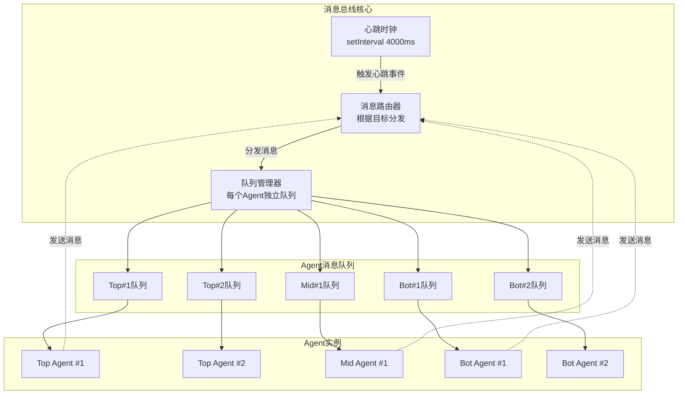
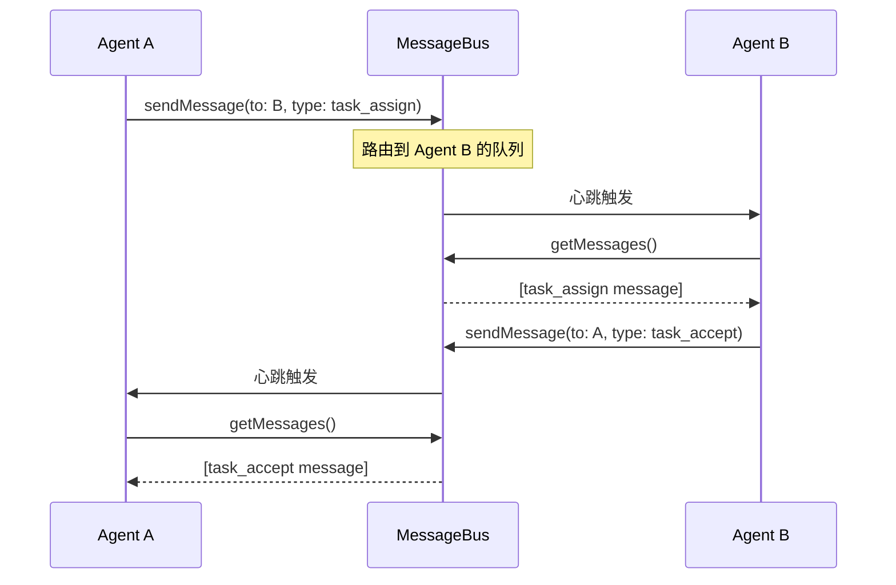
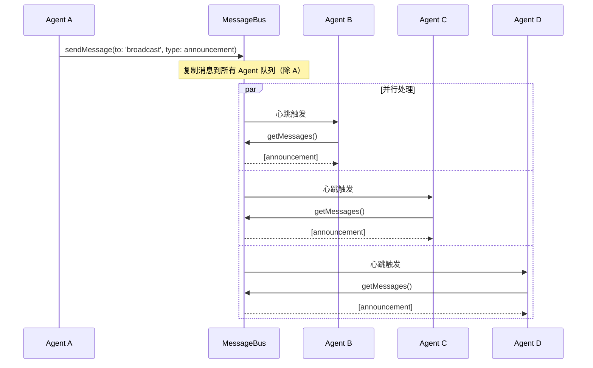
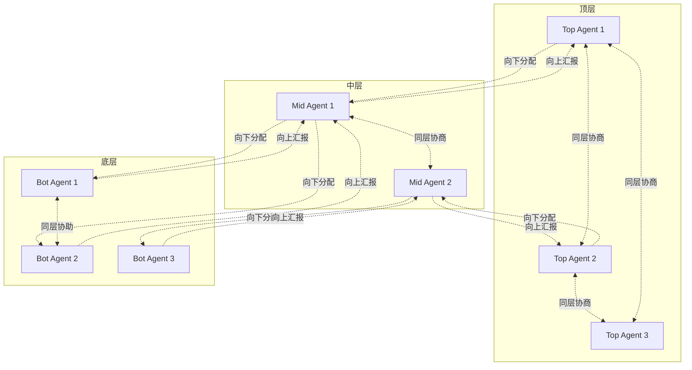

# Spec 03: 通信机制设计

## 1. 概述

本文档详细描述多智能体团队的通信机制，包括心跳消息总线、消息类型体系、路由规则、消息队列管理以及通信模式（点对点、广播、层级通信）。

## 2. 心跳消息总线

### 2.1 核心设计理念

本框架采用 **冯诺伊曼架构风格的统一总线** 设计，所有 Agent 通过心跳总线进行同步通信：

- **固定周期**：每 4 秒触发一次心跳
- **同步模型**：所有 Agent 在心跳时刻同时处理消息
- **简化并发**：避免复杂的异步消息处理和竞态条件
- **可预测性**：系统行为完全由心跳周期驱动，易于调试

```
时间轴：
t=0s    t=4s    t=8s    t=12s   t=16s
 ↓       ↓       ↓       ↓       ↓
[心跳#1] [心跳#2] [心跳#3] [心跳#4] [心跳#5]
 │       │       │       │       │
 └─→所有Agent并行处理消息
```

### 2.2 消息总线架构



### 2.3 消息总线伪代码

```typescript
interface MessageBusConfig {
    heartbeatInterval: number       // 心跳周期（默认 4000ms）
    maxQueueSize: number            // 单个队列最大消息数（默认 1000）
    timeoutThreshold: number        // Agent 超时阈值（默认 3 个心跳周期）
}

class MessageBus {
    private config: MessageBusConfig
    private heartbeatTimer: NodeJS.Timer | null = null
    private currentHeartbeat: number = 0
    private agentQueues: Map<string, Message[]> = new Map()
    private agentLastSeen: Map<string, number> = new Map()
    private listeners: ((heartbeat: number) => void)[] = []
    private database: Database
    private logger: Logger

    constructor(config: MessageBusConfig, database: Database) {
        this.config = config
        this.database = database
        this.logger = createLogger('MessageBus')
    }

    // === 生命周期管理 ===

    start(): void {
        if (this.heartbeatTimer) {
            throw new Error('MessageBus already started')
        }

        this.logger.info('Starting MessageBus...')
        this.currentHeartbeat = 0

        this.heartbeatTimer = setInterval(() => {
            this.tick()
        }, this.config.heartbeatInterval)

        this.logger.info(`MessageBus started (interval: ${this.config.heartbeatInterval}ms)`)
    }

    stop(): void {
        if (this.heartbeatTimer) {
            clearInterval(this.heartbeatTimer)
            this.heartbeatTimer = null
        }

        this.logger.info('MessageBus stopped')
    }

    private tick(): void {
        this.currentHeartbeat++
        this.logger.debug(`Heartbeat #${this.currentHeartbeat}`)

        // 检查超时 Agent
        this.checkTimeouts()

        // 触发所有监听器（通知 Agent 处理消息）
        for (const listener of this.listeners) {
            try {
                listener(this.currentHeartbeat)
            } catch (error) {
                this.logger.error('Listener error:', error)
            }
        }

        // 记录心跳日志
        this.database.logHeartbeat(this.currentHeartbeat, {
            agentCount: this.agentQueues.size,
            totalMessages: this.getTotalMessageCount()
        })
    }

    // === Agent 注册与注销 ===

    registerAgent(agentId: string): void {
        if (this.agentQueues.has(agentId)) {
            throw new Error(`Agent ${agentId} already registered`)
        }

        this.agentQueues.set(agentId, [])
        this.agentLastSeen.set(agentId, this.currentHeartbeat)
        this.logger.info(`Agent ${agentId} registered`)
    }

    unregisterAgent(agentId: string): void {
        this.agentQueues.delete(agentId)
        this.agentLastSeen.delete(agentId)
        this.logger.info(`Agent ${agentId} unregistered`)
    }

    // === 消息发送 ===

    sendMessage(message: Message): void {
        // 验证消息
        this.validateMessage(message)

        // 路由消息
        if (message.to === 'broadcast') {
            this.broadcastMessage(message)
        } else if (message.to === 'system') {
            this.handleSystemMessage(message)
        } else {
            this.routeMessage(message)
        }

        // 记录到数据库
        this.database.saveMessage(message)
    }

    private routeMessage(message: Message): void {
        const targetQueue = this.agentQueues.get(message.to)

        if (!targetQueue) {
            this.logger.warn(`Target agent ${message.to} not found, dropping message`)
            return
        }

        if (targetQueue.length >= this.config.maxQueueSize) {
            this.logger.error(`Queue full for agent ${message.to}, dropping message`)
            return
        }

        targetQueue.push(message)
        this.logger.debug(`Message routed: ${message.from} -> ${message.to} (${message.type})`)
    }

    private broadcastMessage(message: Message): void {
        let deliveredCount = 0

        for (const [agentId, queue] of this.agentQueues) {
            if (agentId === message.from) continue // 不发给自己

            if (queue.length < this.config.maxQueueSize) {
                queue.push({ ...message, to: agentId })
                deliveredCount++
            }
        }

        this.logger.debug(`Broadcast message delivered to ${deliveredCount} agents`)
    }

    private handleSystemMessage(message: Message): void {
        // 系统消息特殊处理（如心跳响应、健康检查）
        if (message.type === 'heartbeat_ack') {
            this.agentLastSeen.set(message.from, this.currentHeartbeat)
        }
    }

    // === 消息接收 ===

    getMessages(agentId: string): Message[] {
        const queue = this.agentQueues.get(agentId)
        if (!queue) return []

        const messages = [...queue]
        queue.length = 0 // 清空队列
        return messages
    }

    // === 心跳监听 ===

    onHeartbeat(callback: (heartbeat: number) => void): void {
        this.listeners.push(callback)
    }

    getCurrentHeartbeat(): number {
        return this.currentHeartbeat
    }

    // === 健康检查 ===

    checkAgentHealth(agentId: string): boolean {
        const lastSeen = this.agentLastSeen.get(agentId)
        if (!lastSeen) return false

        const missedHeartbeats = this.currentHeartbeat - lastSeen
        return missedHeartbeats <= this.config.timeoutThreshold
    }

    private checkTimeouts(): void {
        const timeoutAgents: string[] = []

        for (const [agentId, lastSeen] of this.agentLastSeen) {
            const missedHeartbeats = this.currentHeartbeat - lastSeen

            if (missedHeartbeats > this.config.timeoutThreshold) {
                timeoutAgents.push(agentId)
                this.logger.warn(`Agent ${agentId} timeout (missed ${missedHeartbeats} heartbeats)`)
            }
        }

        // 触发超时事件（由治理引擎处理）
        if (timeoutAgents.length > 0) {
            this.emit('agents_timeout', timeoutAgents)
        }
    }

    // === 辅助方法 ===

    private validateMessage(message: Message): void {
        if (!message.id || !message.from || !message.to || !message.type) {
            throw new Error('Invalid message format')
        }
    }

    private getTotalMessageCount(): number {
        let total = 0
        for (const queue of this.agentQueues.values()) {
            total += queue.length
        }
        return total
    }

    private emit(event: string, data: any): void {
        // 事件发射器（可扩展）
        this.logger.info(`Event emitted: ${event}`, data)
    }
}
```

## 3. 消息类型体系

### 3.1 消息基类

```typescript
interface Message {
    id: string                  // 消息唯一 ID
    from: string                // 发送者 Agent ID
    to: string                  // 接收者 Agent ID（'broadcast' 表示广播）
    type: MessageType           // 消息类型
    content: any                // 消息内容（类型由 type 决定）
    timestamp: number           // 发送时间戳
    priority?: MessagePriority  // 优先级（可选）
    replyTo?: string            // 回复的消息 ID（可选）
}

enum MessagePriority {
    LOW = 0,
    NORMAL = 1,
    HIGH = 2,
    URGENT = 3
}
```

### 3.2 消息类型枚举

```typescript
enum MessageType {
    // === 任务相关 ===
    TASK_ASSIGN = 'task_assign',             // 分配任务
    TASK_ACCEPT = 'task_accept',             // 接受任务
    TASK_REJECT = 'task_reject',             // 拒绝任务
    TASK_COMPLETE = 'task_complete',         // 任务完成
    TASK_FAIL = 'task_fail',                 // 任务失败

    // === 进度汇报 ===
    PROGRESS_REPORT = 'progress_report',     // 进度报告
    STATUS_QUERY = 'status_query',           // 状态查询
    STATUS_REPORT = 'status_report',         // 状态报告

    // === 决策相关 ===
    DECISION_PROPOSE = 'decision_propose',   // 提出决策
    SIGNATURE_REQUEST = 'signature_request', // 请求签字
    SIGNATURE_APPROVE = 'signature_approve', // 签字批准
    SIGNATURE_VETO = 'signature_veto',       // 否决
    APPEAL_REQUEST = 'appeal_request',       // 申诉请求
    APPEAL_RESULT = 'appeal_result',         // 申诉结果

    // === 协调相关 ===
    PEER_COORDINATION = 'peer_coordination', // 同级协调
    PEER_COORDINATION_RESPONSE = 'peer_coordination_response',
    PEER_HELP_REQUEST = 'peer_help_request', // 请求同级帮助
    PEER_HELP_RESPONSE = 'peer_help_response',

    // === 冲突与仲裁 ===
    CONFLICT_REPORT = 'conflict_report',     // 冲突报告
    ARBITRATION_REQUEST = 'arbitration_request', // 仲裁请求
    ARBITRATION_RESULT = 'arbitration_result',   // 仲裁结果
    VOTE_REQUEST = 'vote_request',           // 投票请求
    VOTE_RESPONSE = 'vote_response',         // 投票响应

    // === 错误与恢复 ===
    ERROR_REPORT = 'error_report',           // 错误报告
    ISSUE_ESCALATION = 'issue_escalation',   // 问题上报
    RECOVERY_COMMAND = 'recovery_command',   // 恢复指令

    // === 治理相关 ===
    WARNING_ISSUE = 'warning_issue',         // 警告
    DEMOTION_NOTICE = 'demotion_notice',     // 降级通知
    DISMISSAL_NOTICE = 'dismissal_notice',   // 撤职通知
    PROMOTION_NOTICE = 'promotion_notice',   // 晋升通知
    ELECTION_START = 'election_start',       // 选举开始
    ELECTION_VOTE = 'election_vote',         // 选举投票
    ELECTION_RESULT = 'election_result',     // 选举结果

    // === 系统相关 ===
    HEARTBEAT_ACK = 'heartbeat_ack',         // 心跳确认
    AGENT_REGISTER = 'agent_register',       // Agent 注册
    AGENT_UNREGISTER = 'agent_unregister',   // Agent 注销
    SYSTEM_COMMAND = 'system_command'        // 系统命令
}
```

### 3.3 消息内容结构

#### 任务分配消息
```typescript
interface TaskAssignContent {
    task: {
        id: string
        description: string
        deadline?: number
        dependencies?: string[]
        context: any
    }
}

// 使用示例
const taskAssignMsg: Message = {
    id: generateUUID(),
    from: 'mid-architect',
    to: 'bot-agent-1',
    type: MessageType.TASK_ASSIGN,
    content: {
        task: {
            id: 'task-001',
            description: 'Implement user login API endpoint',
            deadline: Date.now() + 3600000, // 1 hour
            dependencies: [],
            context: {
                framework: 'Express.js',
                database: 'PostgreSQL'
            }
        }
    },
    timestamp: Date.now(),
    priority: MessagePriority.NORMAL
}
```

#### 进度报告消息
```typescript
interface ProgressReportContent {
    taskId: string
    status: 'in_progress' | 'completed' | 'failed'
    percentage: number
    description: string
    result?: any
    blockers?: string[]
}
```

#### 签字请求消息
```typescript
interface SignatureRequestContent {
    decision: {
        id: string
        type: string
        description: string
        proposer: string
        content: any
        requireSigners: string[]
    }
}
```

#### 同级协调消息
```typescript
interface PeerCoordinationContent {
    topic: string
    request: any
    urgency: 'low' | 'medium' | 'high'
}
```

### 3.4 消息工厂

```typescript
class MessageFactory {
    static createTaskAssign(from: string, to: string, task: Task): Message {
        return {
            id: generateUUID(),
            from,
            to,
            type: MessageType.TASK_ASSIGN,
            content: { task },
            timestamp: Date.now(),
            priority: MessagePriority.NORMAL
        }
    }

    static createProgressReport(from: string, to: string, report: ProgressReportContent): Message {
        return {
            id: generateUUID(),
            from,
            to,
            type: MessageType.PROGRESS_REPORT,
            content: report,
            timestamp: Date.now(),
            priority: MessagePriority.NORMAL
        }
    }

    static createSignatureRequest(from: string, to: string, decision: any): Message {
        return {
            id: generateUUID(),
            from,
            to,
            type: MessageType.SIGNATURE_REQUEST,
            content: { decision },
            timestamp: Date.now(),
            priority: MessagePriority.HIGH
        }
    }

    static createBroadcast(from: string, type: MessageType, content: any): Message {
        return {
            id: generateUUID(),
            from,
            to: 'broadcast',
            type,
            content,
            timestamp: Date.now(),
            priority: MessagePriority.NORMAL
        }
    }
}
```

## 4. 通信模式

### 4.1 点对点通信



**使用场景**：
- 上级向下级分配任务
- 下级向上级汇报进度
- 同级之间一对一协商

### 4.2 广播通信



**使用场景**：
- 顶层发布全局公告
- 选举通知
- 紧急事件通知

### 4.3 层级通信



**规则**：
- **向下通信**：上级可以直接向任何下级发送消息
- **向上通信**：下级只能向直接上级发送消息（不能跨级）
- **同层通信**：同一层级的 Agent 可以自由通信
- **跨层通信**：需要通过上级转发

### 4.4 请求-响应模式

```typescript
class RequestResponseHelper {
    private pendingRequests: Map<string, {
        resolve: (response: any) => void
        reject: (error: any) => void
        timeout: NodeJS.Timeout
    }> = new Map()

    async sendRequest(
        agent: BaseAgent,
        to: string,
        type: MessageType,
        content: any,
        timeoutMs: number = 10000
    ): Promise<any> {
        const requestId = generateUUID()

        return new Promise((resolve, reject) => {
            // 设置超时
            const timeout = setTimeout(() => {
                this.pendingRequests.delete(requestId)
                reject(new Error(`Request timeout: ${to} did not respond`))
            }, timeoutMs)

            // 保存请求上下文
            this.pendingRequests.set(requestId, { resolve, reject, timeout })

            // 发送请求消息
            agent.sendMessage(to, type, {
                ...content,
                requestId
            })
        })
    }

    handleResponse(message: Message): void {
        const requestId = message.content.requestId
        const pending = this.pendingRequests.get(requestId)

        if (!pending) {
            logger.warn(`Received response for unknown request: ${requestId}`)
            return
        }

        clearTimeout(pending.timeout)
        this.pendingRequests.delete(requestId)
        pending.resolve(message.content)
    }
}
```

## 5. 消息队列管理

### 5.1 队列优先级

```typescript
class PriorityQueue {
    private queues: Map<MessagePriority, Message[]> = new Map()

    constructor() {
        for (const priority of Object.values(MessagePriority)) {
            if (typeof priority === 'number') {
                this.queues.set(priority, [])
            }
        }
    }

    enqueue(message: Message): void {
        const priority = message.priority ?? MessagePriority.NORMAL
        const queue = this.queues.get(priority)!
        queue.push(message)
    }

    dequeueAll(): Message[] {
        const result: Message[] = []

        // 按优先级从高到低取出消息
        const priorities = [
            MessagePriority.URGENT,
            MessagePriority.HIGH,
            MessagePriority.NORMAL,
            MessagePriority.LOW
        ]

        for (const priority of priorities) {
            const queue = this.queues.get(priority)!
            result.push(...queue)
            queue.length = 0
        }

        return result
    }

    size(): number {
        let total = 0
        for (const queue of this.queues.values()) {
            total += queue.length
        }
        return total
    }
}
```

### 5.2 消息过滤与转换

```typescript
interface MessageFilter {
    (message: Message): boolean
}

interface MessageTransformer {
    (message: Message): Message
}

class MessageProcessor {
    private filters: MessageFilter[] = []
    private transformers: MessageTransformer[] = []

    addFilter(filter: MessageFilter): void {
        this.filters.push(filter)
    }

    addTransformer(transformer: MessageTransformer): void {
        this.transformers.push(transformer)
    }

    process(messages: Message[]): Message[] {
        let result = messages

        // 应用过滤器
        for (const filter of this.filters) {
            result = result.filter(filter)
        }

        // 应用转换器
        for (const transformer of this.transformers) {
            result = result.map(transformer)
        }

        return result
    }
}

// 使用示例
const processor = new MessageProcessor()

// 过滤：只接收来自上级的消息
processor.addFilter(msg => msg.from === this.config.supervisor)

// 转换：添加接收时间戳
processor.addTransformer(msg => ({
    ...msg,
    receivedAt: Date.now()
}))
```

## 6. 消息持久化

### 6.1 消息日志

```typescript
interface MessageLog {
    id: string
    taskId: string
    messageId: string
    from: string
    to: string
    type: MessageType
    content: string // JSON string
    timestamp: number
    heartbeatNumber: number
}

class MessageLogger {
    private database: Database

    async logMessage(message: Message, heartbeatNumber: number, taskId: string): Promise<void> {
        const log: MessageLog = {
            id: generateUUID(),
            taskId,
            messageId: message.id,
            from: message.from,
            to: message.to,
            type: message.type,
            content: JSON.stringify(message.content),
            timestamp: message.timestamp,
            heartbeatNumber
        }

        await this.database.insert('messages', log)
    }

    async queryMessages(filters: {
        taskId?: string
        from?: string
        to?: string
        type?: MessageType
        startTime?: number
        endTime?: number
    }): Promise<MessageLog[]> {
        return await this.database.query('messages', filters)
    }
}
```

### 6.2 消息统计

```typescript
interface MessageStats {
    totalMessages: number
    messagesByType: Record<MessageType, number>
    messagesByAgent: Record<string, { sent: number, received: number }>
    averageLatency: number
    peakThroughput: number
}

class MessageStatsCollector {
    private stats: MessageStats = {
        totalMessages: 0,
        messagesByType: {} as any,
        messagesByAgent: {},
        averageLatency: 0,
        peakThroughput: 0
    }

    recordMessage(message: Message): void {
        this.stats.totalMessages++

        // 按类型统计
        this.stats.messagesByType[message.type] = (this.stats.messagesByType[message.type] || 0) + 1

        // 按 Agent 统计
        if (!this.stats.messagesByAgent[message.from]) {
            this.stats.messagesByAgent[message.from] = { sent: 0, received: 0 }
        }
        if (!this.stats.messagesByAgent[message.to]) {
            this.stats.messagesByAgent[message.to] = { sent: 0, received: 0 }
        }

        this.stats.messagesByAgent[message.from].sent++
        this.stats.messagesByAgent[message.to].received++
    }

    getStats(): MessageStats {
        return { ...this.stats }
    }
}
```

## 7. 性能优化

### 7.1 消息批量发送

```typescript
class BatchMessageSender {
    private batch: Message[] = []
    private batchSize: number = 10
    private messageBus: MessageBus

    addMessage(message: Message): void {
        this.batch.push(message)

        if (this.batch.length >= this.batchSize) {
            this.flush()
        }
    }

    flush(): void {
        for (const message of this.batch) {
            this.messageBus.sendMessage(message)
        }
        this.batch = []
    }
}
```

### 7.2 消息压缩

```typescript
import zlib from 'zlib'

class MessageCompressor {
    static compress(message: Message): Message {
        if (typeof message.content === 'string' && message.content.length > 1024) {
            const compressed = zlib.gzipSync(message.content)
            return {
                ...message,
                content: compressed.toString('base64'),
                _compressed: true
            }
        }
        return message
    }

    static decompress(message: Message & { _compressed?: boolean }): Message {
        if (message._compressed) {
            const decompressed = zlib.gunzipSync(Buffer.from(message.content, 'base64'))
            return {
                ...message,
                content: decompressed.toString(),
                _compressed: undefined
            }
        }
        return message
    }
}
```

## 8. 错误处理

### 8.1 消息发送失败

```typescript
class ReliableMessageBus extends MessageBus {
    private retryQueue: Map<string, { message: Message, retries: number }> = new Map()
    private maxRetries: number = 3

    sendMessage(message: Message): void {
        try {
            super.sendMessage(message)
        } catch (error) {
            logger.error('Message send failed:', error)
            this.enqueueRetry(message)
        }
    }

    private enqueueRetry(message: Message): void {
        const key = message.id
        const entry = this.retryQueue.get(key) || { message, retries: 0 }

        if (entry.retries >= this.maxRetries) {
            logger.error(`Message ${message.id} exceeded max retries, dropping`)
            this.retryQueue.delete(key)
            return
        }

        entry.retries++
        this.retryQueue.set(key, entry)
        logger.info(`Message ${message.id} enqueued for retry (${entry.retries}/${this.maxRetries})`)
    }

    private processRetryQueue(): void {
        for (const [key, entry] of this.retryQueue) {
            try {
                super.sendMessage(entry.message)
                this.retryQueue.delete(key)
                logger.info(`Message ${entry.message.id} retry succeeded`)
            } catch (error) {
                logger.warn(`Message ${entry.message.id} retry failed`)
            }
        }
    }
}
```

### 8.2 队列溢出处理

```typescript
class OverflowHandler {
    static handleQueueFull(agentId: string, droppedMessage: Message): void {
        logger.error(`Queue full for ${agentId}, dropping message ${droppedMessage.id}`)

        // 通知发送者
        if (droppedMessage.from !== 'system') {
            const errorMsg: Message = {
                id: generateUUID(),
                from: 'system',
                to: droppedMessage.from,
                type: MessageType.ERROR_REPORT,
                content: {
                    error: 'QUEUE_FULL',
                    targetAgent: agentId,
                    droppedMessageId: droppedMessage.id
                },
                timestamp: Date.now()
            }

            // 尝试发送错误通知（高优先级）
            errorMsg.priority = MessagePriority.URGENT
        }
    }
}
```

## 9. 测试策略

### 9.1 消息总线测试

```typescript
describe('MessageBus', () => {
    it('should deliver point-to-point message', async () => {
        const bus = new MessageBus(config, db)
        bus.start()

        bus.registerAgent('agent-1')
        bus.registerAgent('agent-2')

        const message = MessageFactory.createTaskAssign('agent-1', 'agent-2', mockTask)
        bus.sendMessage(message)

        // 等待心跳
        await sleep(4000)

        const messages = bus.getMessages('agent-2')
        expect(messages).toHaveLength(1)
        expect(messages[0].type).toBe(MessageType.TASK_ASSIGN)

        bus.stop()
    })

    it('should broadcast message to all agents', async () => {
        const bus = new MessageBus(config, db)
        bus.start()

        bus.registerAgent('agent-1')
        bus.registerAgent('agent-2')
        bus.registerAgent('agent-3')

        const message = MessageFactory.createBroadcast('agent-1', MessageType.ANNOUNCEMENT, { text: 'Hello' })
        bus.sendMessage(message)

        await sleep(4000)

        expect(bus.getMessages('agent-2')).toHaveLength(1)
        expect(bus.getMessages('agent-3')).toHaveLength(1)

        bus.stop()
    })
})
```

## 10. 总结

本通信机制设计确保了：
- **简单可靠**：心跳总线，同步模型，易于理解
- **类型完整**：20+ 消息类型覆盖所有场景
- **灵活路由**：点对点、广播、层级通信
- **高性能**：批量处理、消息压缩、优先级队列
- **可追溯**：完整的消息日志和统计

下一步将详细设计白板系统、治理引擎等模块。
