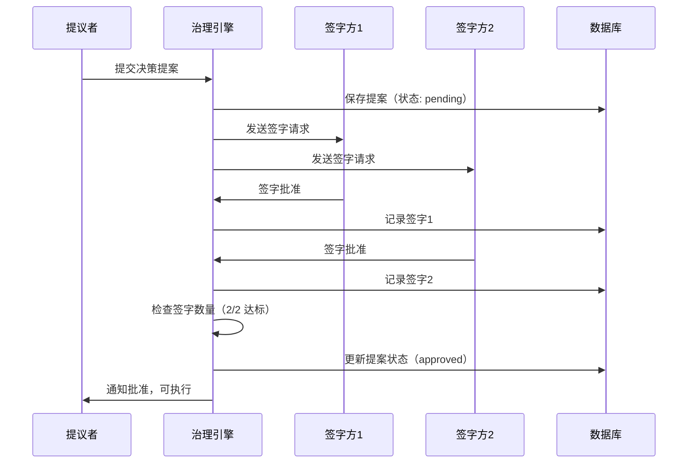
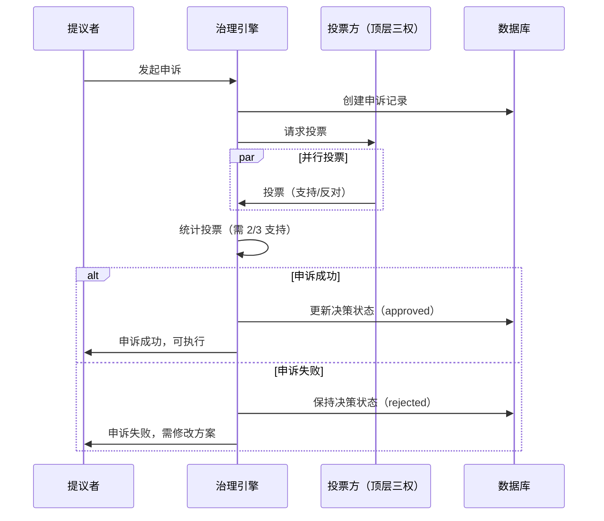

# Spec 05: 权力制衡机制设计

## 1. 概述

本文档详细描述五大权力制衡机制：签字、否决、申诉、问责、选举。这些机制确保 Agent 团队的决策质量、责任追溯和动态优化。

## 2. 签字机制

### 2.1 签字流程



### 2.2 签字规则

| 决策类型 | 需要签字方 | 阈值 | 说明 |
|---------|-----------|------|------|
| **技术方案** | 顶层 2/3 权力 | 2/3 | 重大技术决策需要三权中至少 2 个同意 |
| **任务分配** | 提议者 + 接收者 | 2/2 | 双方确认 |
| **资源调度** | 顶层 2/3 权力 | 2/3 | 调整团队结构、增减 Agent |
| **里程碑确认** | 顶层全体 | 3/3 | 关键里程碑需全体签字 |

### 2.3 实现伪代码

```typescript
enum DecisionType {
    TECHNICAL_PROPOSAL = 'technical_proposal',
    TASK_ALLOCATION = 'task_allocation',
    RESOURCE_ADJUSTMENT = 'resource_adjustment',
    MILESTONE_CONFIRMATION = 'milestone_confirmation'
}

interface Decision {
    id: string
    proposerId: string
    type: DecisionType
    content: any
    requireSigners: string[]
    signers: string[]
    vetoers: string[]
    status: 'pending' | 'approved' | 'rejected' | 'appealing'
    createdAt: number
    approvedAt?: number
}

class SignatureModule {
    async proposeDecision(decision: Omit<Decision, 'id' | 'status' | 'createdAt'>): Promise<Decision> {
        const newDecision: Decision = {
            ...decision,
            id: generateUUID(),
            signers: [],
            vetoers: [],
            status: 'pending',
            createdAt: Date.now()
        }

        await this.database.insert('decisions', newDecision)

        // 发送签字请求消息
        for (const signerId of decision.requireSigners) {
            this.messageBus.sendMessage({
                from: 'system',
                to: signerId,
                type: MessageType.SIGNATURE_REQUEST,
                content: { decision: newDecision }
            })
        }

        return newDecision
    }

    async signDecision(decisionId: string, signerId: string): Promise<void> {
        const decision = await this.database.get('decisions', decisionId)

        if (!decision.requireSigners.includes(signerId)) {
            throw new Error(`${signerId} is not a required signer`)
        }

        if (decision.signers.includes(signerId)) {
            throw new Error(`${signerId} has already signed`)
        }

        decision.signers.push(signerId)

        // 检查是否达到阈值
        const threshold = this.getSignatureThreshold(decision.type)
        if (decision.signers.length >= threshold) {
            decision.status = 'approved'
            decision.approvedAt = Date.now()

            // 通知提议者
            this.messageBus.sendMessage({
                from: 'system',
                to: decision.proposerId,
                type: MessageType.SIGNATURE_APPROVE,
                content: { decisionId }
            })

            // 记录到全局白板
            await this.recordDecisionToWhiteboard(decision)
        }

        await this.database.update('decisions', decisionId, decision)

        logger.info(`Decision ${decisionId} signed by ${signerId} (${decision.signers.length}/${decision.requireSigners.length})`)
    }

    private getSignatureThreshold(type: DecisionType): number {
        const thresholds = {
            [DecisionType.TECHNICAL_PROPOSAL]: 2,
            [DecisionType.TASK_ALLOCATION]: 2,
            [DecisionType.RESOURCE_ADJUSTMENT]: 2,
            [DecisionType.MILESTONE_CONFIRMATION]: 3
        }
        return thresholds[type] || 1
    }
}
```

## 3. 否决机制

### 3.1 否决规则

- 任何有权签字的一方都可以行使否决权
- 否决后决策进入 "rejected" 状态
- 提议者可以选择：修改方案重新提交 OR 发起申诉

### 3.2 实现伪代码

```typescript
class VetoModule {
    async vetoDecision(decisionId: string, vetoerId: string, reason: string): Promise<void> {
        const decision = await this.database.get('decisions', decisionId)

        if (!decision.requireSigners.includes(vetoerId)) {
            throw new Error(`${vetoerId} is not authorized to veto`)
        }

        if (decision.status !== 'pending') {
            throw new Error(`Cannot veto decision in status ${decision.status}`)
        }

        decision.vetoers.push(vetoerId)
        decision.status = 'rejected'

        await this.database.update('decisions', decisionId, decision)

        // 记录否决到审计日志
        await this.database.insert('audits', {
            id: generateUUID(),
            taskId: this.currentTaskId,
            agentId: vetoerId,
            eventType: 'veto',
            reason: reason,
            targetDecisionId: decisionId,
            createdAt: Date.now()
        })

        // 通知提议者
        this.messageBus.sendMessage({
            from: 'system',
            to: decision.proposerId,
            type: MessageType.SIGNATURE_VETO,
            content: {
                decisionId,
                vetoer: vetoerId,
                reason
            }
        })

        logger.info(`Decision ${decisionId} vetoed by ${vetoerId}: ${reason}`)
    }
}
```

## 4. 申诉机制

### 4.1 申诉流程



### 4.2 实现伪代码

```typescript
interface Appeal {
    id: string
    decisionId: string
    appealerId: string
    arguments: string
    votes: { agentId: string, vote: 'support' | 'oppose' }[]
    result?: 'success' | 'failed'
    createdAt: number
    resolvedAt?: number
}

class AppealModule {
    async createAppeal(decisionId: string, appealerId: string, arguments: string): Promise<Appeal> {
        const decision = await this.database.get('decisions', decisionId)

        if (decision.proposerId !== appealerId) {
            throw new Error('Only proposer can appeal')
        }

        if (decision.status !== 'rejected') {
            throw new Error('Can only appeal rejected decisions')
        }

        const appeal: Appeal = {
            id: generateUUID(),
            decisionId,
            appealerId,
            arguments,
            votes: [],
            createdAt: Date.now()
        }

        await this.database.insert('appeals', appeal)

        // 更新决策状态
        decision.status = 'appealing'
        await this.database.update('decisions', decisionId, decision)

        // 请求顶层三权投票
        const topLayerAgents = this.getTopLayerAgents()
        for (const agent of topLayerAgents) {
            this.messageBus.sendMessage({
                from: 'system',
                to: agent.id,
                type: MessageType.VOTE_REQUEST,
                content: { appeal }
            })
        }

        return appeal
    }

    async voteOnAppeal(appealId: string, voterId: string, vote: 'support' | 'oppose'): Promise<void> {
        const appeal = await this.database.get('appeals', appealId)

        if (appeal.votes.some(v => v.agentId === voterId)) {
            throw new Error(`${voterId} has already voted`)
        }

        appeal.votes.push({ agentId: voterId, vote })

        // 检查是否所有人已投票
        const topLayerCount = 3
        if (appeal.votes.length === topLayerCount) {
            const supportCount = appeal.votes.filter(v => v.vote === 'support').length
            const threshold = Math.ceil(topLayerCount * 2 / 3) // 2/3

            if (supportCount >= threshold) {
                appeal.result = 'success'
                appeal.resolvedAt = Date.now()

                // 批准原决策
                const decision = await this.database.get('decisions', appeal.decisionId)
                decision.status = 'approved'
                decision.approvedAt = Date.now()
                await this.database.update('decisions', appeal.decisionId, decision)

                this.messageBus.sendMessage({
                    from: 'system',
                    to: appeal.appealerId,
                    type: MessageType.APPEAL_RESULT,
                    content: { result: 'success' }
                })
            } else {
                appeal.result = 'failed'
                appeal.resolvedAt = Date.now()

                this.messageBus.sendMessage({
                    from: 'system',
                    to: appeal.appealerId,
                    type: MessageType.APPEAL_RESULT,
                    content: { result: 'failed' }
                })
            }
        }

        await this.database.update('appeals', appealId, appeal)
    }
}
```

## 5. 问责机制

### 5.1 问责触发条件

| 触发事件 | 责任人定位 | 惩罚 |
|---------|-----------|------|
| 任务失败 | 任务执行者 + 签字批准者 | 1 次警告 |
| 连续 3 次任务失败 | 任务执行者 | 降级或撤职 |
| 质量问题 | 代码提交者 + 审查者 | 1 次警告 |
| 资源浪费 | 资源分配决策签字方 | 1 次警告 |
| 累计 3 次警告 | 相关 Agent | 撤职 |

### 5.2 实现伪代码

```typescript
interface AuditRecord {
    id: string
    taskId: string
    agentId: string
    eventType: 'warning' | 'demotion' | 'dismissal' | 'promotion'
    reason: string
    relatedDecisionId?: string
    createdAt: number
}

class AccountabilityModule {
    async reportFailure(taskId: string, failureReason: string): Promise<void> {
        // 1. 定位责任人
        const responsibleAgents = await this.identifyResponsibleAgents(taskId)

        // 2. 对每个责任人发出警告
        for (const agentId of responsibleAgents) {
            await this.issueWarning(agentId, `Task ${taskId} failed: ${failureReason}`)
        }
    }

    async issueWarning(agentId: string, reason: string): Promise<void> {
        const audit: AuditRecord = {
            id: generateUUID(),
            taskId: this.currentTaskId,
            agentId,
            eventType: 'warning',
            reason,
            createdAt: Date.now()
        }

        await this.database.insert('audits', audit)

        // 更新 Agent 指标
        const agent = await this.database.get('agents', agentId)
        agent.warningsReceived = (agent.warningsReceived || 0) + 1

        // 检查是否达到撤职阈值
        if (agent.warningsReceived >= 3) {
            await this.dismissAgent(agentId, 'Accumulated 3 warnings')
        }

        await this.database.update('agents', agentId, agent)

        // 通知 Agent
        this.messageBus.sendMessage({
            from: 'system',
            to: agentId,
            type: MessageType.WARNING_ISSUE,
            content: { reason }
        })

        logger.warn(`Warning issued to ${agentId}: ${reason}`)
    }

    async dismissAgent(agentId: string, reason: string): Promise<void> {
        const audit: AuditRecord = {
            id: generateUUID(),
            taskId: this.currentTaskId,
            agentId,
            eventType: 'dismissal',
            reason,
            createdAt: Date.now()
        }

        await this.database.insert('audits', audit)

        // 更新 Agent 状态
        const agent = await this.database.get('agents', agentId)
        agent.status = 'terminated'
        await this.database.update('agents', agentId, agent)

        // 通知上级
        this.messageBus.sendMessage({
            from: 'system',
            to: agent.supervisor!,
            type: MessageType.DISMISSAL_NOTICE,
            content: { agentId, reason }
        })

        logger.info(`Agent ${agentId} dismissed: ${reason}`)

        // 触发替换流程
        await this.initiateAgentReplacement(agentId)
    }

    private async identifyResponsibleAgents(taskId: string): Promise<string[]> {
        // 查找任务分配记录
        const taskRecord = await this.database.query('messages', {
            type: MessageType.TASK_ASSIGN,
            'content.task.id': taskId
        })

        if (!taskRecord || taskRecord.length === 0) {
            return []
        }

        const assignees = taskRecord.map(r => r.to)

        // 查找签字批准该任务的 Agent
        const relatedDecisions = await this.database.query('decisions', {
            'content.taskId': taskId,
            status: 'approved'
        })

        const signers = relatedDecisions.flatMap(d => d.signers)

        return [...new Set([...assignees, ...signers])]
    }
}
```

## 6. 选举机制

### 6.1 选举周期

- **触发时机**：每 50 个心跳周期（约 200 秒 / 3.3 分钟）
- **评估维度**：任务完成数、成功率、响应速度、协作质量
- **结果**：晋升、维持、降级、撤职

### 6.2 绩效评分算法

```typescript
interface PerformanceScore {
    agentId: string
    tasksCompleted: number
    tasksFailed: number
    successRate: number
    averageResponseTime: number
    collaborationScore: number
    overallScore: number
}

class PerformanceEvaluator {
    calculateScore(agentId: string): PerformanceScore {
        const metrics = this.getAgentMetrics(agentId)

        const successRate = metrics.tasksCompleted / (metrics.tasksCompleted + metrics.tasksFailed)
        const responsiveness = this.calculateResponsiveness(metrics)
        const collaboration = this.calculateCollaborationScore(agentId)

        const overallScore = (
            successRate * 0.4 +
            responsiveness * 0.3 +
            collaboration * 0.3
        ) * 100

        return {
            agentId,
            tasksCompleted: metrics.tasksCompleted,
            tasksFailed: metrics.tasksFailed,
            successRate,
            averageResponseTime: metrics.averageTaskDuration,
            collaborationScore: collaboration,
            overallScore
        }
    }

    private calculateResponsiveness(metrics: AgentMetrics): number {
        // 响应速度评分（0-1）
        const maxTime = 60000 // 60 秒
        const score = 1 - Math.min(metrics.averageTaskDuration / maxTime, 1)
        return score
    }

    private calculateCollaborationScore(agentId: string): number {
        // 协作质量评分（基于同级评价、消息响应率等）
        // ... 实现细节
        return 0.8
    }
}
```

### 6.3 选举流程

```typescript
class ElectionModule {
    async triggerElection(layer: string, round: number): Promise<void> {
        logger.info(`Election round ${round} started for layer: ${layer}`)

        const agents = this.getAgentsByLayer(layer)
        const scores: PerformanceScore[] = []

        // 1. 评估所有 Agent
        for (const agent of agents) {
            const score = this.evaluator.calculateScore(agent.id)
            scores.push(score)
        }

        // 2. 排序
        scores.sort((a, b) => b.overallScore - a.overallScore)

        // 3. 决定晋升/降级/撤职
        const actions: ElectionAction[] = []

        for (let i = 0; i < scores.length; i++) {
            const score = scores[i]

            if (score.overallScore >= 80) {
                // 优秀，考虑晋升
                if (layer === 'bottom' && i === 0) {
                    actions.push({ agentId: score.agentId, action: 'promote' })
                }
            } else if (score.overallScore < 40) {
                // 不及格，撤职
                actions.push({ agentId: score.agentId, action: 'dismiss' })
            } else if (score.overallScore < 60) {
                // 较差，降级
                if (layer === 'mid') {
                    actions.push({ agentId: score.agentId, action: 'demote' })
                }
            }
        }

        // 4. 执行操作
        for (const action of actions) {
            await this.executeElectionAction(action)
        }

        // 5. 记录选举结果
        await this.database.insert('elections', {
            id: generateUUID(),
            taskId: this.currentTaskId,
            round,
            layer,
            results: JSON.stringify(scores),
            actions: JSON.stringify(actions),
            createdAt: Date.now()
        })

        logger.info(`Election round ${round} completed: ${actions.length} actions taken`)
    }

    private async executeElectionAction(action: ElectionAction): Promise<void> {
        switch (action.action) {
            case 'promote':
                await this.promoteAgent(action.agentId)
                break
            case 'demote':
                await this.demoteAgent(action.agentId)
                break
            case 'dismiss':
                await this.accountabilityModule.dismissAgent(action.agentId, 'Poor performance in election')
                break
        }
    }

    private async promoteAgent(agentId: string): Promise<void> {
        // 晋升逻辑（底层 -> 中层）
        const agent = await this.database.get('agents', agentId)

        if (agent.layer === 'bottom') {
            // 创建新的中层角色
            const newMidAgent = await this.teamManager.createMidLayerAgent({
                role: `Promoted-${agent.role}`,
                domain: agent.domain,
                promotedFrom: agentId
            })

            // 记录晋升
            await this.database.insert('audits', {
                id: generateUUID(),
                taskId: this.currentTaskId,
                agentId,
                eventType: 'promotion',
                reason: 'Outstanding performance in election',
                createdAt: Date.now()
            })

            logger.info(`Agent ${agentId} promoted to mid-layer`)
        }
    }
}
```

## 7. 总结

五大权力制衡机制确保了：
- **签字机制**：重大决策多方确认，防止单点失误
- **否决机制**：异议方有制衡权，避免强制推行
- **申诉机制**：提供救济途径，防止错误否决
- **问责机制**：失败可追溯，责任人受惩罚
- **选举机制**：动态优化团队，淘汰低效成员

这些机制共同构建了一个自我纠错、持续优化的 Agent 治理体系。
